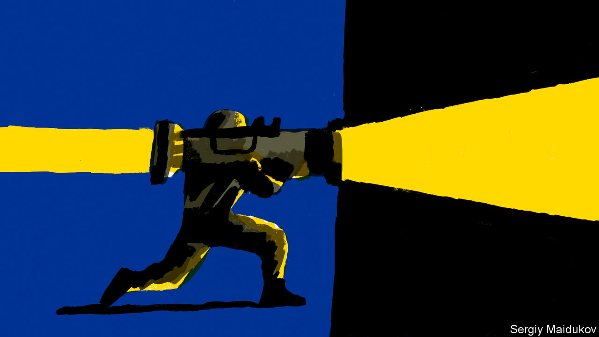

###### Inspiration nation

# Our country of the year for 2022 can only be Ukraine 

##### For the heroism of its people, and for standing up to a bully 

 

> Dec 20th 2022 

In normal times, picking ’s country of the year is hard. Our writers and editors usually begin with a freewheeling debate in which they spar over the rival claims of half a dozen shortlisted nations. But this year, for the first time since we started naming countries of the year in 2013, the choice is obvious. It can only be Ukraine.

The honour normally goes to the country which, in our view, has improved the most in the previous 12 months. So Ukraine is in one sense an unusual choice, in that life for most Ukrainians has grown spectacularly worse since Vladimir Putin’s unprovoked invasion of their country in February. Multitudes have died. Cities have been smashed and charred. Millions have fled their homes. Ukraine’s economy has shrunk by about a third. Because of Russian attacks, many Ukrainians are shivering in the dark without electricity.

Yet Ukrainians have proved themselves this year. Four of their qualities stand out. The first is . When the invasion began, most people thought Ukraine would be crushed by its much larger neighbour. Many would have understood if Ukraine’s defenders had run away. Mr Putin clearly expected the Ukrainian army to fold: his troops arrived with their dress uniforms ready for a victory parade but without nearly enough food.

The Ukrainians stood and fought. President Volodymyr Zelensky, spurning Western offers to spirit him out of Kyiv, supposedly snapped that he needed “ammunition, not a ride”. Ordinary Ukrainians showed similar mettle. Professors, plumbers and pop stars flocked to enlist, swapping comfortable beds for frosty foxholes and the risk of agonising death. In battle after battle they routed the Russians. In defending themselves against an aggressor who disputed their country’s right to exist as an independent state, they found a new sense of nationhood.

They showed, too. They spotted their enemies’ weaknesses, blew up their fuel and ammunition supplies, and quickly learned how to use new Western-supplied weapons. They devolved decision-making to officers in the field, making their units more nimble and adaptable than the plodding, hierarchical Russians. They made deft use of help from friendly intelligence services, especially America’s, while their enemies fought half-blind, and sometimes gave away their own positions by making phone calls on open lines.

Ukrainians have also demonstrated. When there is no tap water at home, they melt snow. When there is no electricity, they find heat and light in cafés with diesel generators, or sleep in the offices where they work, many of which now have bomb shelters and bottled water. The horrors Mr Putin keeps inflicting on them do not seem to have dented their morale.

And with a few exceptions, they have not answered war crimes with war crimes. Russian forces have routinely bombed civilians, tortured captives and plundered villages. By contrast, Russian prisoners-of-war are startled at how well they are treated. This is largely because Ukraine is not, as Mr Putin claims, a Nazi state, but a democracy where human lives matter. It has its flaws, notably corruption, but its government and people had rejected Putinism even before the war, and now they reject it more strenuously.

By standing up to Russia’s despot, Ukrainians have protected their neighbours. Had he conquered Ukraine, he might have attacked Moldova or Georgia next, or menaced the Baltic states. Ukraine has shown that , even enormous ones. It has thus been an not only to places with predatory neighbours, such as Taiwan, but also to oppressed people everywhere. Many tyrants broadcast big lies to justify their misdeeds, and impose their will through terror. Ukrainians have shown that lies can be exposed and terror can be resisted. Their struggle is far from over. But their example in 2022 was second to none.■


