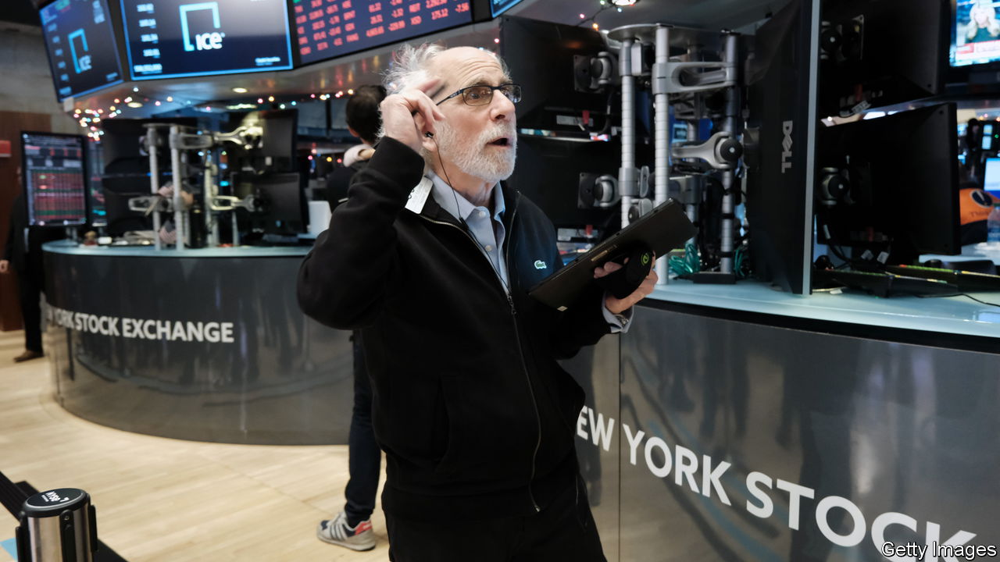
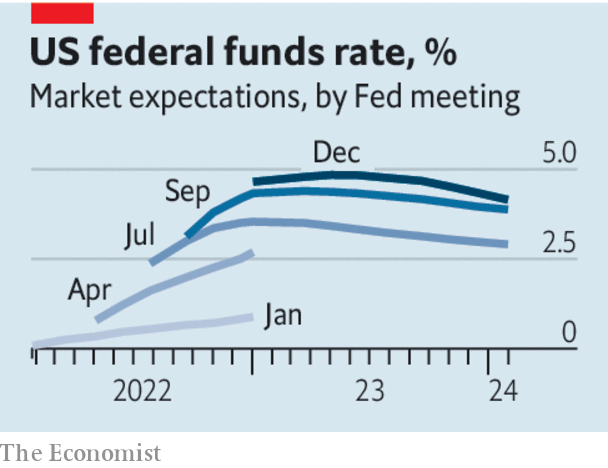

###### After the storm

# The year of the rate shock 

##### Financial markets are adjusting to higher rates. That does not mean the chaos is over 

 

> Dec 20th 2022 

ONcE MORE for the cheap seats at the back. That way the lesson may sink in. After a strong run from mid-October, stockmarkets have tumbled yet again. The s&amp;p 500, an index of American shares, has shed 5% since December 14th, when the Federal Reserve increased interest rates by half a percentage point and Jerome Powell, its chairman, said that policymakers had no plans to start lowering rates until they were confident that inflation was moving down to 2%. “The historical record cautions strongly against prematurely loosening policy,” he declared. 

The end of cheap money caused drama in markets in 2022. Investors are hopeful that the chaos will soon be over and that a rate cut might come as soon as mid-2023. However, Mr Powell’s warning sounds like an effort to drive home the idea that the optimism is misplaced. 

 


It would not be the first time. Markets have collapsed after most Fed meetings this year, as investors have been shaken by Mr Powell’s hawkish tone. In each of the five worst weeks for American stocks in 2022, shares plunged by about 5%. All of them took place immediately before or after a Fed meeting. As inflation, first unleashed by a fiscal stimulus, proved stickier than expected, the increasingly hawkish central bank meted out monster rate rises even as investors kept hoping that it might let up. When the stockmarket peaked in America on January 3rd, bond markets thought that the upper bound of the Fed’s policy rate of 0.25% would rise by just 0.75 percentage points by the end of the year. In the event, it stands at 4.5%. 

The fierce tightening of monetary policy was the trigger for much of the turbulence that rocked finance in 2022. The collapse in tech share prices was so violent that Meta has twice shed more than a quarter of its value in a single trading day. The rout in bond markets was so extreme that corporate issuance and loan markets seized up in the spring. British pension funds were thrown into turmoil in the autumn by moves in gilt prices, and the collapse in crypto revealed what American authorities are calling a “massive years-long fraud” at FTx, an exchange, perpetrated by Sam Bankman-Fried, a former wunderkind. On December 20th the Bank of Japan roiled markets by  of capping long-term interest rates. Each case had its idiosyncrasies, but all were exposed when the era of free money came to an abrupt end. 

Will things be calmer in 2023? Interest rates are higher across most of the rich world than they have been for more than 15 years, so much of the rate shock may seem to be safely in the past. Inflation appears to be abating, in America at least. Though many countries in Europe are still struggling with high energy costs, price increases seem to have slowed there, too. Perhaps the adjustment, though painful, is largely done. 

Such thinking could well prove mistaken. For a start, a gulf remains between what the Fed says it will do and what investors expect from it. The central bank reckons it may have to raise interest rates above 5% in 2023, and leave them there. That does not tally with investors’ expectations. Despite Mr Powell’s warnings, they are betting on a shallower peak and continue to think that the first rate cut may come as soon as the summer. 

In short, policymakers and investors still differ over the most important questions. How sticky will inflation be? At what level will rates peak? And when will central bankers start to ease off? 

Another source of uncertainty is whether America will enter a recession and, if so, when. The Fed reckons that it may be spared, projecting slow growth of 0.4-1% in 2023, and inflation of around 2.9-3.5%. If recession does strike, investors will not be ready. Analysts say that profits could well grow by 7.6% in 2023, well above nominal gdp. 

Last, the effects of the rate shock are still working their way through to asset prices. So far, only the quickest and twitchiest asset markets, like stocks, bonds and crypto, have adjusted. Those moves are still being digested by financial institutions. Only in crypto have large firms been in real danger, with some lending platforms, exchanges and hedge funds going bust. 

However, the interest-rate shock could yet expose cracks elsewhere in the financial system. And more pain is to come. Prices have yet to adjust in markets that are slower to mark down assets, as in private equity and property. 

The Jay walk

The rate shock dominated financial markets in 2022. Little wonder that investors wish an end to it. Yet the big debates about inflation and interest rates remain unresolved; investors’ hopes for growth and profits look too rosy; and the effects of rate rises have yet to filter through to all corners of the financial system. Whatever investors choose to believe, the chaos of 2022 could well follow them into the new year. ■

