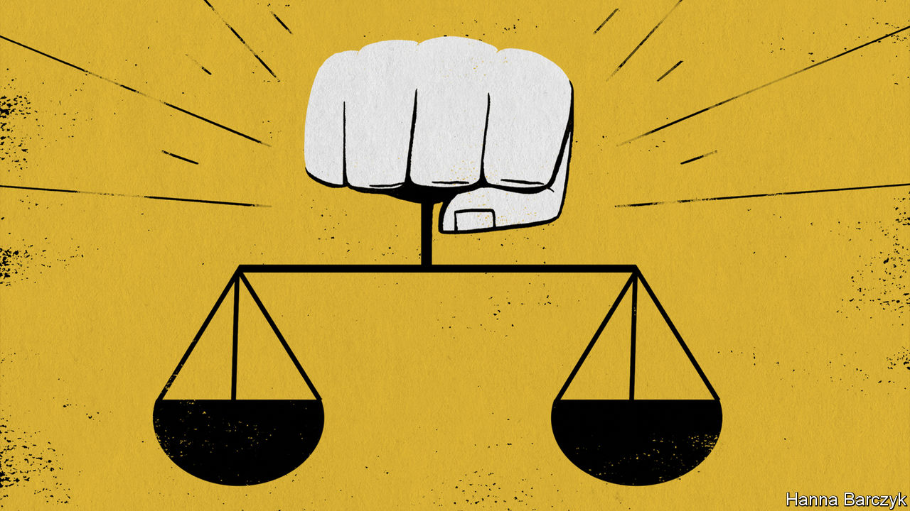

###### The crucible

# What 2022 meant for the world 

##### Some years bring disorder, others a resolution. This one asked questions 

 

> Dec 20th 2022 

IT WAS A year that put the world to the test. From the invasion of Ukraine to covid-19 in China, from inflation to climate change, from Sino-American tensions to pivotal elections, 2022 asked hard questions. The ordeal has not only sent the world in a new direction, but also shown it in a new light.

The biggest surprise—and the most welcome—has been the resilience of broadly liberal countries in the West. When Vladimir Putin ordered Russian troops into Ukraine on February 24th, he expected the government of a corrupt state to buckle. After a humiliating withdrawal from Afghanistan in 2021, the decadent, divided West would surely fail to match condemnation of Russia with real backing for Ukraine.

In fact Volodymyr Zelensky and his people affirmed that self-determination and liberty are worth dying for. They became . After an upsurge in popular support, Western governments threw their weight behind democracy’s new champion. Led by the Biden administration, the West is providing arms and aid on a scale even hawks had not imagined. 

At home voters also made themselves heard, siding against taboo-busting populists. In America, despite the awful approval numbers of Joe Biden, centrists used their ballots to preserve fundamental rights, including in some states the right to an abortion after the Supreme Court overturned . In competitive races hard-core election-deniers endorsed by Donald Trump almost all lost. 

In France Marine Le Pen camouflaged her far-right origins, but was still beaten by Emmanuel Macron, a centrist. After Giorgia Meloni became Italy’s first far-right post-war prime minister, she leaned to the centre. Even in stumbling Britain, both Labour and the governing Conservatives are calculating that victory in elections lies away from the populist extremes of right and left.

As messy democracies show unexpected resolve, so seemingly steady autocracies have had feet of clay. Mr Putin is the prime example, doubling and redoubling his catastrophic gamble. But he is not the only one. After three months of protests following the death in custody of Mahsa Amini, who had been arrested for failing to follow the rules in wearing her hijab, the security forces in Iran have taken to shooting female protesters in the face, breasts and genitals. Now that the mullahs have forfeited the faith of their people, they have no other lever but violence. 

Those who admire strong leaders for getting things done should be careful what they wish for. Xi Jinping has extended the dominance of the Chinese Communist Party, installing himself as its permanent chief and the most powerful leader since Mao Zedong. But his steps to cool the property market, rein back consumer tech and block covid did grave harm to the economy. Today, as the virus spreads, it is clear that his government wasted months when it should have been vaccinating the elderly, stockpiling drugs and creating intensive-care beds.

Even China’s all-encompassing social control showed cracks. Although the Chinese security services swatted down widespread protests last month, these had been triggered partly by the sight of maskless crowds in Qatar enjoying the World Cup.

For all those who embrace classical liberal values, including this newspaper, Western resilience is heartening—and an important change after a long retreat. But the good news goes only so far. The tests of 2022 have also revealed the depths of the world’s divisions and have set big government on the march.

To gauge the divisions, compare the almost universal support for America after the attacks of September 11th 2001 with the global south’s determination to stay neutral in the fight over Ukraine. In the most recent UN vote to reprimand Russia, 35 countries abstained. Many understandably resent how the West asserts that its worries are issues of global principle, whereas war in Yemen or the Horn of Africa, say, or climate-related droughts and floods, always seem to be regional. 

In much of the world liberal values are embattled. Despite the defeat of Jair Bolsonaro in Brazil, democracy is under strain in Latin America. As he presides over ruinous inflation in Turkey, Recep Tayyip Erdogan is prosecuting potential opponents in the election in 2023. In Israel Binyamin Netanyahu is trying to avoid jail for corruption by forming a coalition with the Arab-hating, gay-bashing far right. Indonesia adopted an illiberal criminal code in December that threatens to ban sex outside marriage, stifle free speech and impose religious orthodoxy. India’s economy is brimming over with tech-inspired enterprise, but its politics are majoritarian, ugly and cruel.

All around the world, the idea of limited government is taking a beating. Because of the post-invasion energy shock, European governments are pouring money into fixing prices. They are also powering the transition from fossil fuels, itself a welcome goal, using industrial policy rather than markets. America’s answer to the security threat from China is to deploy trade barriers and subsidies to decouple its own economy and boost home-grown industries. If that harms America’s allies, too bad. 

Economic nationalism is popular. The largesse during the pandemic changed expectations of the state. Creative destruction, which reallocates capital and labour, may be unpalatable to ageing populations that put less store by economic growth and to younger voters who embrace the politics of identity.

But big-government capitalism has a poor record. Given decades-high inflation, caused partly by ill-judged fiscal and monetary policy, especially in America, it is odd that voters want to reward politicians and officials by giving them power over bits of the economy they are not suited to run. State-backed champions in energy and tech sometimes succeed, but the more that countries pile in, the more waste and rent-seeking there will be.

The chips were down

Judged by the liberal yardstick of limited government, a respect for individual dignity and a faith in human progress, 2022 has been mixed. However, there is hope. The West was arrogant after the collapse of Soviet communism. It paid the price in Iraq, Afghanistan and the global financial crisis of 2007-09. In 2022, having been rocked by populism at home and China’s extraordinary rise, the West was challenged and it found its footing. ■


