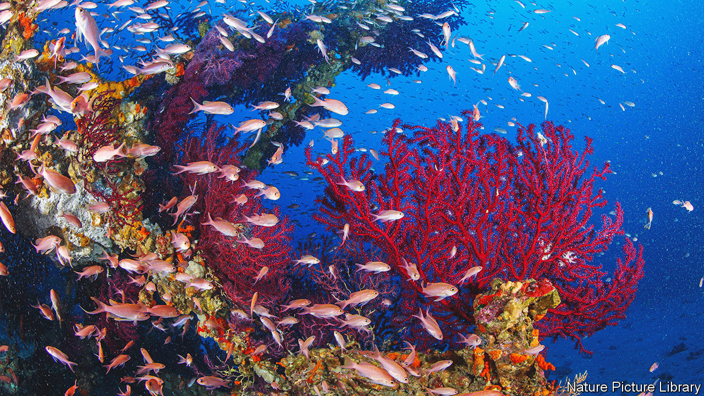

###### The laws of nature

# Why climate change is intimately tied to biodiversity 

##### There is a financial case for investing in biodiversity 

 

> Dec 20th 2022 

The natural world is a source of beauty and wonder, but it also provides humans with essential services. Jungles, savannahs and mangroves act as buffers against infectious diseases and storm surges. Forests channel moisture into rivers that irrigate crops, while their roots prevent landslides. At a gathering on Monday in Montreal, 196 governments from around the world pledged to protect and restore 30% or more of the Earth’s water and land by 2030. 

Lofty promises about preserving the world’s biodiversity have been made and broken many times before. One step towards avoiding yet more disappointment is to emphasise the close link between preserving biodiversity and the widely held goal of reaching net-zero carbon emissions.

The destruction of natural environments is depressing, relentless and hard to ignore. The area of coral reefs has halved since the 1950s and the rate of loss is accelerating. Some 10m hectares of forest are lost worldwide every year. Less known is the link between biodiversity and climate change. Each year more than a quarter of the carbon dioxide emitted by industry and agriculture is absorbed by natural ecosystems. 

Around the world, investment in the energy transition is accelerating. Spending in 2022 on clean energy, for example, should reach $1.4trn, roughly a fifth above the pre-pandemic level. Scores of countries and thousands of big companies have plans to get to net-zero emissions within the next 20-30 years. Given that biodiversity has an important role in meeting these carbon-reduction goals, you might think that it would feature highly in these plans.

Not so. For example, Joe Biden’s chief piece of climate legislation, the Inflation Reduction Act, contains about $400bn of subsidies for clean energy and other initiatives yet has too little to say about biodiversity. Faced with tighter regulation of emissions and carbon-pricing schemes, many bosses are now dedicating more time and cash to cutting their firms’ carbon footprints. But most still regard biodiversity as a nice-to-have luxury that is far beyond their remit.

That needs to change. Safeguarding biodiversity is an efficient way to control carbon emissions. More of the rising amounts of government spending being thrown at mitigating and adapting to climate change should be spent on it.

In addition, companies and investment firms that are allocating huge sums to developing clean-energy sources, re-engineering industrial processes and developing carbon-capture technologies should pay more attention to the opportunities from preserving ecosystems. By investing in biodiversity—directing capital to projects that repair an ecosystem, for example—companies can offset their emissions. By some estimates, schemes to manage carbon-rich peatlands and wetlands and to reforest cleared land could provide more than one-third of the emissions reductions that are needed to prevent more than 2°C of global warming.

Key to marshalling more capital is better measurement, so that the link between investment in natural projects, biodiversity and carbon is made clear. Today some so-called carbon-offset schemes that involve firms paying money to, say, plant a forest, are dubious and opaque—and belong to the realm of con-artists and scams rather than science. Better guidelines and practice can help and so can new technology. Drones and satellites can improve the measurement of biodiversity and accounting systems can measure how spending on biodiversity compares with funnelling cash into other kinds of carbon management.

The services ecology

The planet is in a vicious cycle in which global warming damages ecosystems, in turn impairing their ability to absorb carbon. Over the past 20 years the Amazon has become a net source of carbon dioxide, emitting 13% more than it captures. Spending money on nature need not only be an act of philanthropy. It can also be attractive for governments and firms investing in mitigating climate change. ■


