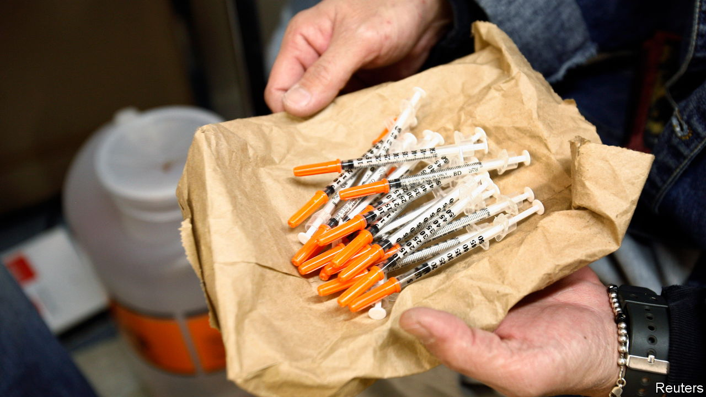
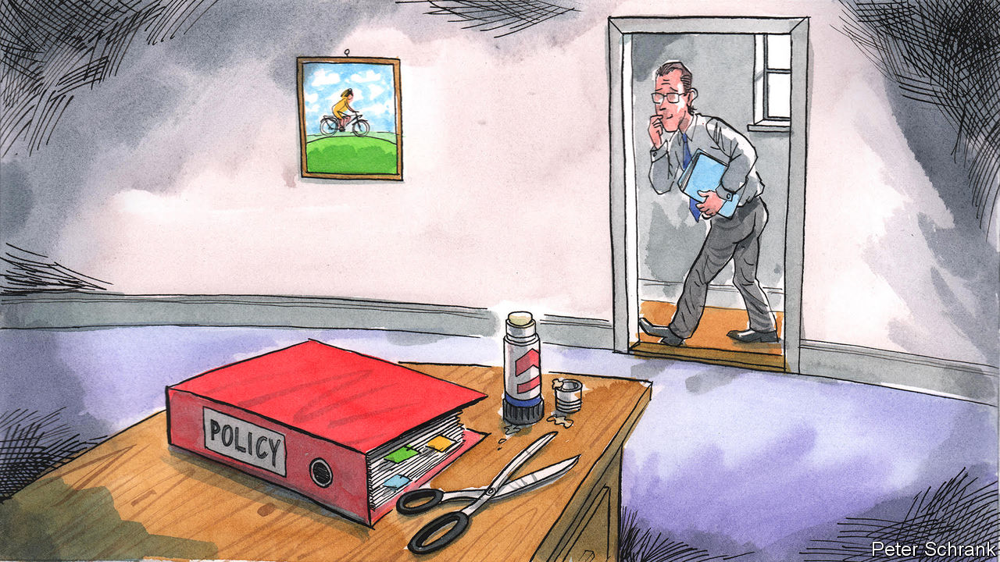
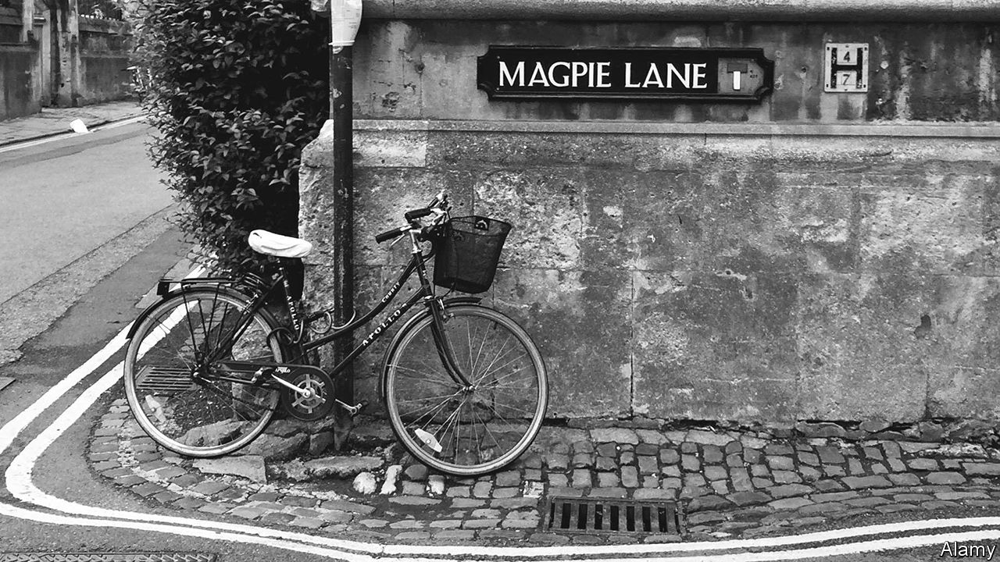
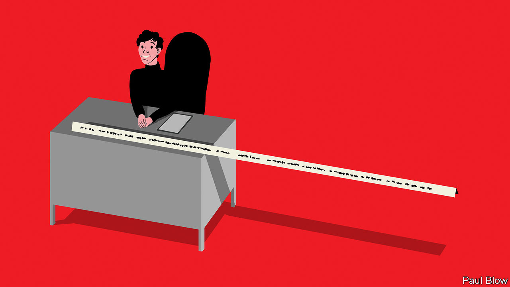

###### On needle-exchange programmes, Kenya, the EU, the Titanic, street names, job titles

# Letters to the editor 

##### A selection of correspondence 

 

> Dec 20th 2022 


Needle-exchange policies

Your article on syringe exchanges did not recognise the continuing challenge of HIV and the weight of evidence on harm reduction (“”, December 3rd). Across the world, 1.5m people were newly infected with HIV last year. Because of stigma, discrimination and criminalisation, people who inject drugs and their sexual partners are 35 times more likely to contract HIV than people who do not inject drugs. Needle and syringe programmes, as part of a comprehensive package of harm-reduction services, are effective in preventing HIV and in connecting people who inject drugs to other life- saving services. 

Your article, based on a single new study in a rapidly changing drug-use environment, did not reflect the wealth of research. HIV guidelines for people who use drugs, released by the World Health Organisation this year, reviewed the most recent evidence and made a strong data-informed recommendation for the prioritisation of needle and syringe programmes for drug users. 

To end the AIDS pandemic the world needs to move away from failed, punitive, stigmatising approaches towards a human-rights, community-led approach, rooted in decades of experience and evidence. 

Winnie Byanyima

Executive director 

UNAIDS


The distribution of sterile syringes and other life-saving services is not the reason why 556,472 people have died of opioid-related overdoses from 2000 to 2020. Over this period, opioid-related fatal overdoses increased by 716% and synthetic opioid-related fatal overdoses by 5,833%. The real moral hazards were the drug firms’ gross production and promotion of legally prescribed opioids without having to bear the cost of the ensuing epidemic, and the production of synthetic opioid-laced illicit drugs with little consideration of the rocketing rates of fatal overdose among users.

To “do no harm” do not stigmatise people with substance use disorders as “junkies” and “addicts”. To determine which policies work, do what harm-reduction researchers do: follow the science, the full breadth of it, including studies that use multiple methods and that evaluate a range of harm reduction and overdose- prevention efforts. 

Brian Weir

Assistant scientist

Professor Susan Sherman

Johns Hopkins Bloomberg School of Public Health


The more discussion on intravenous drug abuse the better. I have volunteered at a needle exchange in Fresno that exchanges up to 30,000 needles on a Saturday afternoon. People who avail themselves of such programmes avoid the risk of dirty needles and associated drug paraphernalia. Many such exchanges have free primary health-care services attached to them, and every person who works there will find a moment to ask about treatment. I have personally witnessed the miracle of a person using the needle-exchange programme, receiving free doctor care on a Saturday and going to a local clinic for treatment the following Monday. The exchanges do not encourage people to do drugs. If someone is abusing drugs they will continue to do so, clean or dirty needles . Alas the power of addiction is such that it trumps all rational behaviour. 

Alex Dodd

Former CEO of Aegis Treatment Centers 


 


Without fear or frontiers

I got to know Kenya’s boda-boda motorbike taxis during a Rotary humanitarian visit to the country (“”, December 3rd). They were driving all over the place, in the city and in the countryside, transporting passengers, chickens and building material. They certainly have a disdain for traffic rules and there are many accidents. The general hospital in Nairobi even has a special ward for boda-boda casualties. Interestingly, boda-boda has come to mean border-to-border, as indeed they criss-cross the country from border to border and also drive over the border into neighbouring countries.

Greta Cleynhens Du Bois


 


Swapping ideas in the EU

Charlemagne suggested that the European Union’s “one-size-fits-all” policies hold back the spread of good ideas between its members (). However, when it comes to road safety, the EU shares precisely the kind of smart thinking highlighted in the column. In an EU-funded project called Road Safety Exchange, we have taken Lithuanian policymakers to see the Dutch cycling infrastructure that so impressed your correspondent. Polish experts came with us to look at France’s ultra-efficient traffic-fine processing centre, and Portuguese specialists got a hands-on look at how the Irish do roadside drug-driving checks. The “sharing of best practice” may be awful Brussels jargon, but the EU can be genuinely good at it and, in our case, the results can even save lives.

Dudley Curtis

European Transport Safety Council


Charlemagne quoted Tom Lehrer’s advice to plagiarise: “it’s why the good Lord made your eyes”. But he should have cited the rest of Mr Lehrer’s wisdom on plagiarism: always remember to call it research.

Moray Clayton


 


A failure to communicate

Your article on the sinking of the  (“, November 26th), said that the radio officer of the nearby  was “asleep”. According to Parks Stephenson, who has investigated the wreck, before going off duty the officer carried out his captain’s instruction to warn ships in the vicinity about ice, but was brusquely told to shut up by the ’s radio officer because he was interrupting the transmission of passenger messages. That was an hour before the ’s encounter with the fatal iceberg. 

Official inquiries established that, although the  failed to act on seeing flares fired from the , her role had she done so would have been the same as the , the first ship to pick up passengers from lifeboats. James Cameron’s Jack, in the water, would still have died. 

Simon Timm


 


Street racers

Regarding unusual street names (“”, November 26th), some of my favourites are in the village of Silverstone, from which the motor-racing circuit takes its name. Here there is a Stewart Drive, Brabham Close and Graham Hill.

Stuart King


 


And what do you do?

Bartleby’s column on job-title inflation was excellent (). I remember a meeting I had in the 1990s with executives from a retail chain based in Michigan. The company let its managers make up their own titles. I was handed business cards that read “Queen of the Inventories”, “Merchandising Maven” and “Secret Weapon”. I recall that this group of managers was a particularly happy one.

Satyen Hombali


When I was an undergraduate one of my roommates took pride in his part-time job: “I focus exclusively on the retail distribution of refined petroleum products.”

Andre Moncheur de Rieudotte


You might be amused by this snippet from “Full Moon” by P.G. Wodehouse: “Is there anything higher than a vice-president? ‘Well, as a matter of fact,’ Freddie confessed, in a burst of candour, ‘in most of these American concerns …vice-president is about where you start. I fancy my guerdon ought to be something more on the lines of assistant sales manager.’”

David Lindsay


As any fan of the American version of “The Office” would tell you, there is a world of difference between “assistant to the regional manager” and “assistant regional manager”.

Nareg Seferian


