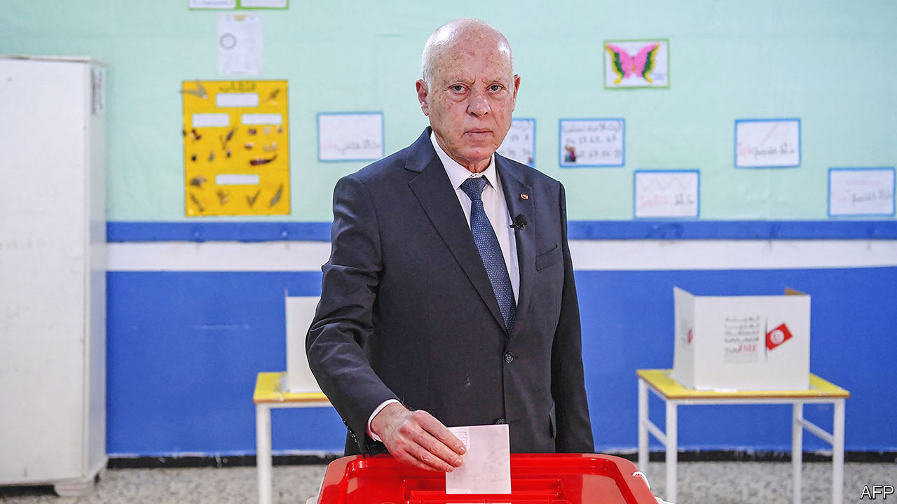

###### One Saied-ed

# A farcical election pushes Tunisia towards one-man rule 

##### Voter turnout was lower than the inflation rate 

 

> Dec 20th 2022 

THE LAST time voters in La Goulette, a suburb of the Tunisian capital, had to pick a representative in parliament, it was a complicated choice. No fewer than 56 parties fielded candidates for their district. They had a rather easier time of it in Tunisia’s parliamentary election on December 17th: only one candidate was on the ballot. It is hard to imagine that there was very much suspense in his campaign headquarters as the results came in.

This was the climax of a 17-month power grab led by Kais Saied, the country’s authoritarian president. In July 2021 he suspended much of the constitution and  to bar the doors of parliament; he later dismissed its members. He went on to sack judges; install loyalists in key agencies, including the electoral commission; and harass and arrest critics. This summer he hastily shoved through  to dilute parliament’s power.

In a grim bit of irony, the election came 12 years to the day after Muhammad Bouazizi, a street hawker, set himself on fire to protest against extortion by the local police. His death was the spark for the overthrow of Zine el-Abidine Ben Ali, the longtime dictator, the creation of a flawed but real democracy in Tunisia, and the Arab spring more generally.

By the time Mr Saied was elected in 2019, many Tunisians had come to despair of their post-revolutionary politicians, who seemed more interested in fighting each other than fixing problems. The president has lived up to his promise to change the political system. Yet he has done almost nothing to tackle the economic mess that caused so much of the public’s anger, which may soon be directed at him.

Mr Saied, who blames political parties for much of the deadlock, sought to reduce their role in this election: party logos, for example, were not displayed on ballots next to the names of candidates. Major parties decided to boycott the poll, and only 1,058 candidates met the requirements to run for 161 seats.

Beyond La Goulette, nine other districts had one-man races. Elsewhere the choice was even simpler: seven of ten constituencies that represent the diaspora had no candidates. The Tunisian embassy in London did not bother to open a polling station because there was nobody to vote for.

Even where races were competitive, the candidates were often nobodies. The party boycott left a motley crew of individual candidates—anyone who could gather 400 signatures and self-finance a short campaign. Many Tunisians had no idea who was on the ballot. The electoral commission wound up affixing a headshot of each candidate next to his (rarely her) name: instead of voting for parties, voters could opt for the candidates with the best hair.

Turnout was predictably low, with only about 800,000 of the country’s 9m registered voters bothering to show up. Mr Saied had promised that the new parliament, freed from the shackles of party politics, would be the most democratic in Tunisia’s history. Instead he delivered a legislature elected by less than 9% of voters.

The Salvation Front, an opposition group, quickly called for protests and demanded that Mr Saied step down. So did Abir Moussi, who ran against Mr Saied in the presidential election of 2019. The front includes Ennahda, an Islamist party that has been a powerful force in Tunisia’s democratic politics, whereas Ms Moussi is a staunch anti-Islamist and self-professed admirer of the deposed dictatorship. That such ideological opposites find themselves aligned against Mr Saied says much about his dwindling support.

At first his self-coup in 2021 had wide backing from a frustrated public. Polls showed his approval ratings above 80%, unprecedented for a Tunisian president (or, indeed, for most politicians). But his popularity was short-lived. Official turnout for the constitutional referendum in July was a mere 30%, and many think that number was inflated. His poll numbers keep sliding. Few Tunisians turn up for pro-Saied rallies.

There is little optimism that Mr Saied’s government and his new rubber-stamp parliament will do much to turn around the economy. The diagnosis has not changed much: Tunisia is unproductive. It has a bloated public sector with one of the world’s highest wage bills (18% of GDP). State-run companies are uncompetitive. Decades of underinvestment in the poorer south and west have left those regions lagging far behind Tunis, the capital.

If the root causes are unchanged, though, the symptoms have worsened. The economy shrank by almost 9% in 2020 and growth remains sluggish. Soaring food and energy prices this summer caused a balance-of-payments crisis, with shortages of sugar, butter, cooking oil and other staples as . Even bottled water has been rationed. Annual inflation jumped to 9.8% in November. It is a truly unhealthy democracy that announces a voter-turnout figure lower than its headline-inflation rate.

What has saved Mr Saied, until now, is apathy. If he cannot organise big rallies, neither can the opposition: most Tunisians are too disgusted with politics (and too busy trying to survive) to take to the streets in protest.

But Mr Saied cannot rely on the public’s quiescence for ever. A debt-to-GDP ratio of around 90% looks ominous. A hoped-for deal with the IMF remains stalled, in part due to opposition from the UGTT, a powerful trade union. More shortages and price rises—and perhaps protests—are likely next year. Mr Saied has done much to return Tunisia to one-man rule. His inattention to the economy, however, means he may not long remain that man. ■

