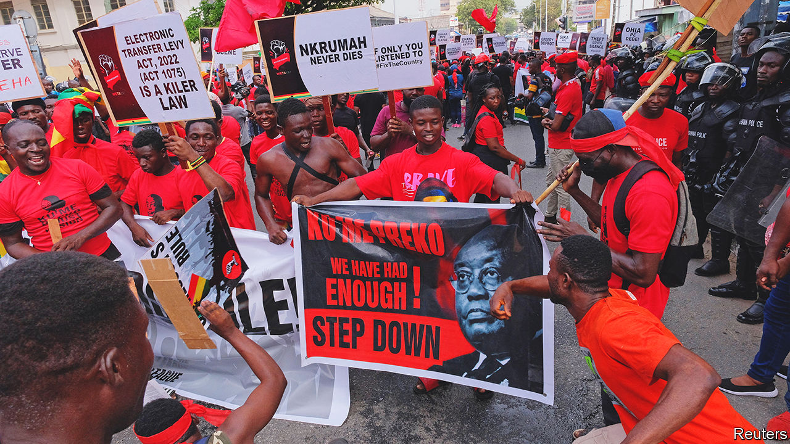
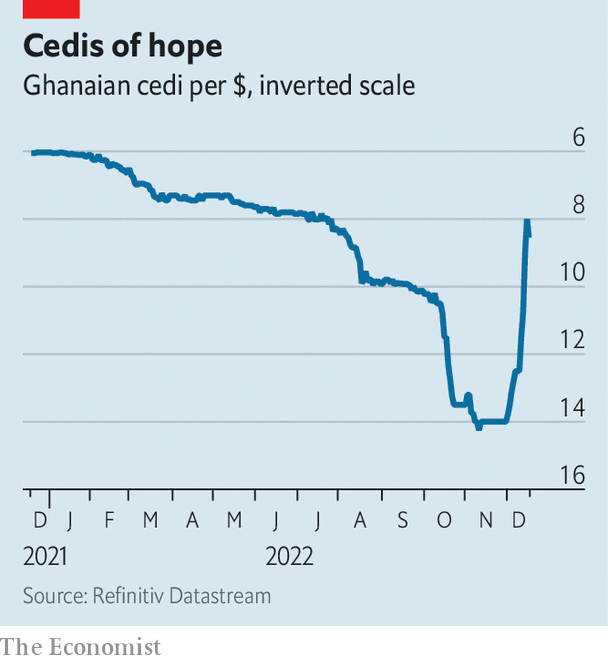

###### Finding faith in the fund

# Ghana has struck a preliminary IMF deal and halted debt payments 

##### Pain and hope loom in equal measure 

 

> Dec 20th 2022 

Ken Ofori-Atta, Ghana’s finance minister, is fond of invoking scripture in speeches on the economy. Recently, as the country defaulted on its domestic debt, he found solace in the first book of Samuel saying “nothing will be lost, nothing will be missing.” Yet the Bible is a poor guide to macroeconomics. Holders of domestic bonds stand to lose a good chunk of money. Now foreign creditors are getting a buzz cut, too. On December 19th Ghana suspended interest payments to foreign creditors, in effect defaulting, pending talks. 

It has also appealed to the high priests of economic orthodoxy, agreeing to a preliminary $3bn bail-out (about 4% of gdp) from the IMF. It needs the help.  is above 100% of GDP and local and foreign interest payments eat up 70-100% of revenue, according to Mr Ofori-Atta. Inflation is running at 50% and the central bank has raised its main interest rate to 27%. In past crises Ghana has wisely  to head off trouble and avoid spending cuts that were too painful. This time, however, it dallied for so long that austerity alone will not save it. 

The government blames covid-19 and surging global inflation for its pickle. Yet its troubles can also be traced to overspending, excessive borrowing and overconfidence. This is hardly new. Ghana’s governments tend to blow their budgets to win votes in election years. But recent splurges were funded largely by foreign-currency bonds, making Ghana especially vulnerable to swings in exchange rates. 

Nonetheless Mr Ofori-Atta was far from contrite as he announced the deal with the IMF. “Let us all gather the harvest with joy,” he proclaimed. He even thanked his disgraced deputy, Charles Adu Boahen, who was sacked by President Nana Akufo-Addo last month after being accused of asking for a $200,000 fee to set up a meeting with the vice-president. The triumphalism will rile long-suffering Ghanaians. Many think Mr Ofori-Atta, a cousin of the president, should himself have been fired for poor management of the economy.

 


The fund’s deal will bring pain. But it also offers hope. It aims to slash debt to 55% of gdp in the medium term, perhaps by 2028, and the costs of servicing foreign-currency debts to 18% of government revenue. Next year’s budget includes spending cuts worth 2% of GDP. (A vast national cathedral that Mr Ofori-Atta lavished $58m of public money on will remain a stalled building site.) Social programmes will be protected, says the fund, though some worry Mr Ofori-Atta’s promise to review them for efficiencies may be a pretext for more cuts. The agreement is already boosting confidence in Ghana’s economy. The currency, the cedi, had slumped all year but has leapt since the bail-out was announced (see chart).

The government is trying to make progress on a debt restructuring, a condition of the deal. In early December Mr Ofori-Atta said the holders of domestic bonds worth 137bn cedis ($15.2bn) should swap these for ones paying a lower rate of interest and that will be repaid over a longer period. The exchange, which was meant to be completed by December 19th, would represent a loss of about 50% of the value of the bonds, reckons J.P. Morgan, a bank.

This would create a new set of problems. Ghana’s banks are heavily exposed to government debt. For some it represents more than half of total assets. A huge hit to the banking system could cause lending to plunge, which would in turn hurt the wider economy. The biggest danger will be next year, when the government’s replacement bonds will pay no interest at all, warns Ernest Addison, the governor of the Central Bank of Ghana. “Straight away there are issues of liquidity,” he says. 

Ghanaians are already pulling money out of mutual funds, says Frederick Duvor of Apakan Securities, a brokerage firm in Ghana. “People want to salvage what’s left of their investments.” Pension schemes will be hit, too. By the time many pensions are paid out, “it will be worth close to nothing,” he worries. Banks, pension funds and insurers have all demanded better terms. Last week the government blinked and extended the deadline to the end of the year. It may also tweak the scheme. 

Nervous policymakers are trying to prop up the banks. The central bank will loosen liquidity and capital-adequacy requirements. The government promises that a donor-backed fund worth 15bn cedis will help ensure financial stability. Mr Addison says the World Bank has committed $250m to it. All this should help. Yet when asked if he is therefore not too worried, Mr Addison simply says, “It is early.”

Garnering debt

Investors holding $13bn of Ghana’s foreign-currency bonds will not get off lightly, either. The government has previously floated talk of a 30% cut to the face value of the debt it will repay and suspension of some interest payments. This, too, may result in a fight, though some bondholders say they expect a relatively quick deal.

There are plenty of longer-term obstacles to Ghana’s recovery. Badly hit banks will not lend much for as long as it takes them to rebuild their balance-sheets. Interest rates will remain eye-watering for some time. Government spending will be austere for years. And the weak global economy will be a drag on growth, too. 

Yet Ghana has been here before—16 times in fact. All those crises and bail-outs have not stopped it from becoming the richest country in continental west Africa as measured by income per head. It has a relatively educated workforce and widely available (if pricey) electricity. Some of its loose spending went on much-needed infrastructure. “We could actually get quite nice growth within two or three years,” reckons Charles Robertson of Renaissance Capital, an investment bank, “led by cheap currency and a low debt overhang.” 

Ghana has one other formidable advantage: a surprisingly resilient reputation with donors and foreign investors based on its robust democracy, record of development and its leaders’ knack for selling a good-news story about the country. That Ghana managed to clinch a deal with the imf in less than six months suggests its reputation as a country worth backing remains miraculously intact. Other donors are likely to follow suit. 

The recent surge in the cedi suggests some investors are already believers again. If the global economic picture improves, more may be tempted back. That would give Ghana a leg-up. But before it is able to emerge into this promised land of growth, its people face a painful journey. For this they blame the government, despite its repeated appeals to a higher authority. ■

