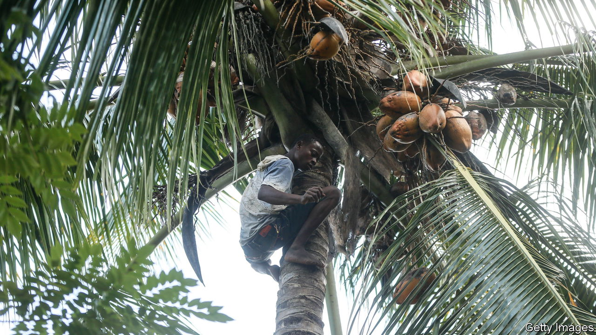

###### Urbanisation gone nuts

# What the price of Zanzibari coconuts says about African development 

##### Islanders are chopping down trees as cities expand 

 

> Dec 20th 2022 

Musa Haidar holds a coconut to his ear and shakes it from side to side. Its sloshing pleases the market trader, who puts the large brown ovoid back atop the pile at his stall on the outskirts of City, the main one on the east African island. 

His customers are less happy, however. A coconut going for 500 Tanzanian shillings ($0.20) a few years ago today sells for 1,500 shillings. That makes it more expensive to whip up curries or other dishes using coconut milk. “The prices you see,” says Mr Haidar, “they’re not normal. Coconuts have become expensive for local people.” 

Why have prices gone nuts? “People are chopping, chopping,” explains Omar Yusuf Juma, another coconut seller, swinging his machete for effect. A count in 2013-14 found just 3.4m coconut trees, down from 5.7m in the late 1990s. Since hungry Zanzibaris still demand creamy fish curries and beans baked in coconut milk, falling supply has led to higher prices. Nuts from the mainland are pricier because of high transport costs. 

The felling of coconut trees reflects how Zanzibar and the rest of Africa are urbanising. The defining feature of Africa’s expanding cities is sprawl: cities are oozing outwards rather than growing upwards. As Zanzibar City has spread farther into erstwhile countryside, when people move to their new plots they chop down the coconut trees to make space for their new homes. 

Moreover, some houses, as well as many island hotels, have furniture made from coconut wood. Emmanuel Elias, a carpenter, explains that it is cheaper than imported alternatives. By law farmers cannot chop down fruit-bearing trees for furniture; in practice it is hard to stop them. Even if they abide by the rules, many do not plant new trees, since these take at least six years to produce fruit, and 15 years to reach maximum production levels. State subsidies for seedlings have proved no match for urban population growth. 

In his workshop Mr Elias dusts off a sleek dressing table he is selling for 400,000 shillings. He points out the striking black dots inside the grain that are the hallmark of coconut wood. “This is the land of coconut trees,” he says. But for how much longer?

