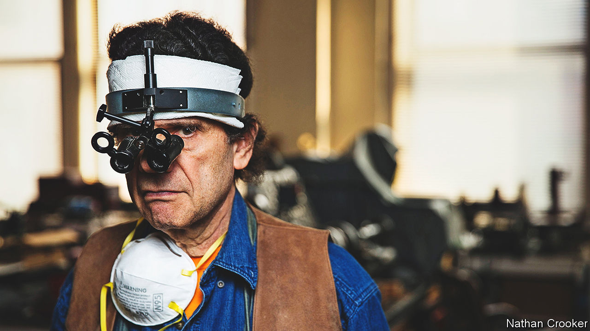

###### The endless quest

# Daniel Brush’s drive to understand beauty led him to the life of a hermit 

##### The astonishing worker in gold, jewels and steel died on November 26th, aged 75 

 

> Dec 20th 2022 

In September 2017 a group of young women from a jewellery school came to Daniel Brush’s studio-cum-home, a loft in mid-Manhattan. They crammed onto his sofas, awed to be meeting a figure who, to them, was a worker of miracles with gold, steel and jewels: an artist unknown to all but a few who considered him one of best there was. 

He, facing them, could hardly stand still for nerves. He leaned against the wall as if he hoped it would swallow him. His words jerked, and sometimes burst out in anger. Deliberately, he still wore his surgical binoculars and 40-power loupe clamped over his eyes and his leather apron round his waist. He had broken off his work to talk to them, he was touched to see them, but he must get back to it. He had to get back. 

For 45 years in that loft, living like a hermit, he had pursued his calling. Almost no one knew he was there or what he was doing. His wife Olivia was the only company he needed; his work was her work. Together they set a rhythm to each day, and over 40 years it did not change. Every breakfast, Cheerios; every lunch, lentil soup. He rose very early and then, for three or four hours, swept the loft to empty his mind, as an apprentice initiate might sweep a temple. Pacing, reading and meditating, especially on Zen texts or ancient technical manuals, were necessary to the work. So was worrying. Did he have anything to say? Did he know enough? 

If he thought he did, he would be in the studio by 11, and might work for 18 hours straight. He went in like a boxer, expecting a fight. His thoughts and the material grappled together as long as his momentum lasted; he downed tools as soon as it lapsed. A piece might dwell in the studio for decades before he addressed it again. He did not grasp or use the word “complete”, for the work was never-ending. 

He produced hundreds of objects: boxes, brooches, collars, perfume flasks,  of all sorts, most of them exquisite and many astonishingly small. He once made 117 collars, over three years, simply to have them photographed as a “visual poem” in a book. It was still time well spent. Every piece advanced his understanding of the materials he was using. 

Those materials included marble, aluminium and even Bakelite, sometimes presented to him by fans who simply wondered what he might make of them. When one of his devotees presented him with a packet of tiny pink diamonds from Australia, he whimsically decorated the Bakelite with sparkling flamingos and rabbits; but he refused to be called a jeweller. Jewellers traditionally waxed, cast and filed; he wrought and struggled. Working with steel, for example, was almost brutal: hammering, forging, chiselling, resharpening for every cut, like forcing an ice-breaker through Antarctica. 

Each piece was hand-made there in the studio. He worked alone, too impatient to do otherwise, and never finding anyone else who wanted to do what he wanted to do. Rather than use electricity, he laboured in a forest of antique machines, including the largest private collection of lathes in the world. On these he turned minutely patterned boxes made of mastodon ivory 40m years old, or engraved thousands of rainbow-reflecting lines on flattened billets of steel. When tools frustrated him he made his own, displaying them in cabinets as art in themselves. He painted, too, applying the same technique—learned from Japanese Noh theatre—as he did to the objects he sculpted or turned. Using his grandfather’s ruling-pen, containing one drop of ink, he would approach the paper, inhale, and make one line; then exhale, step back, and repeat until the momentum stopped. 

Above all else, he worked in gold. He did so first in 1967, when he bought an ounce of it to make Olivia’s wedding ring. Yet his obsession had taken fire long before, on a trip to London, when at 13 he had seen an Etruscan gold bowl in the Victoria and Albert Museum. The ancient technique of granulation, applying geometries of gold beads as fine as sand-grains to a curved gold surface without solder, was stunning, but so was the lightness of spirit, the insouciance of the thing. 

 He resolved then and there that he would make such a bowl, and gold became the study of his life. Simply to watch it melt, turn to red-hot and white-hot, then glow purple, was magical. To hold pure gold grain and let it sift through his fingers restored his equanimity of spirit. To outside eyes his own granulation, with 78,000 hand-made grains applied to one dome five inches in diameter, was peerless. He thought he was still rubbish at it. 

What was this search? What was his work for? Certainly not for fame. And not for money, either. He refused to take commissions, though his pieces could command six-figure sums, because neither he nor Olivia could bear to let them go. They crowded his studio as the record of his life, and of passing time. His dreams and blood were in them. They could be bought only by those who had the sensitivity to appreciate what they were. That connection of ideas, as the piece passed from warm hand to warm hand, was where their only value lay. 

His chief motivation, he said, was to understand both the material and, through that, himself. He wanted to know why his heart had beat so fast in the V&amp;A that day. Gold in particular had a message for him. His manipulation of this glorious metal, like his daily sweeping of the loft, might empty his mind to hear it. He longed for that clarity. 

It would come, he believed, if he took ego out of the process; if he became a vessel the pieces just flowed through. His work could then be precious to others not in a monetary way, but as a link to something greater and a source of calm. He had long admired the Tendai monks of Japan, who made gruelling treks through the mountains to find enlightenment. He loved the idea that such a monk might take a Brush piece out of a pocket, let its beauty pass from emptied mind to emptied mind, and smile. That too was what its maker was after. ■

