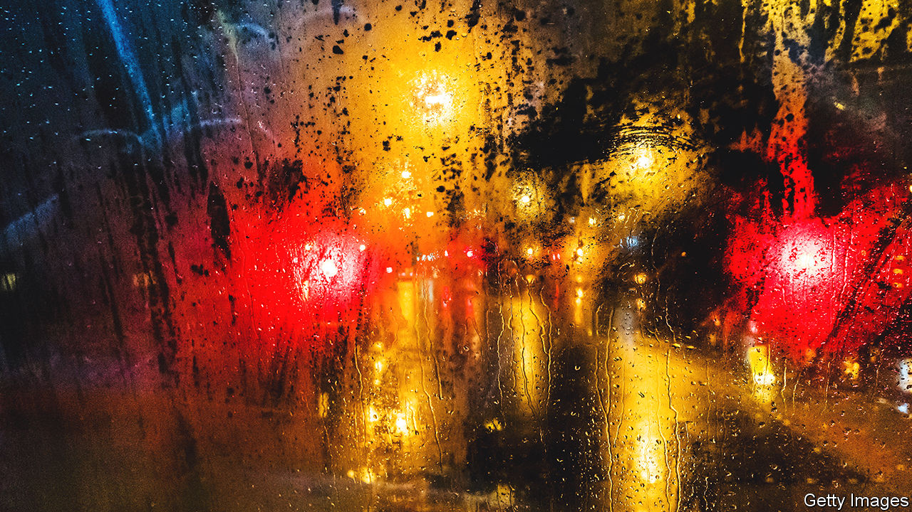

###### Smart coatings

# A golden sandwich that demists your windscreen 

##### It is a clever use of nanotechnology 

 

> Dec 20th 2022 

As the northern hemisphere’s winter arrives, the problem of fogged-up car windscreens becomes more pressing for drivers. When humid air hits a surface colder than it is the water vapour it carries condenses onto that surface as myriad tiny droplets. These scatter light at random. The result, if the surface is transparent, looks to a human eye like fog. Depending on what is fogged, be it windows, spectacle lenses or windscreens, that can be a curiosity, a nuisance or a serious hazard.

Antimisting sprays are one way to deal with such fogging. But they need frequent reapplication. Another approach is to embed within the thing to be demisted a set of electrically powered heating wires. That works for a car’s rear window but not (because of the visual distraction created) for its front windscreen. Nor does it suit the windows of buildings or the lenses of spectacles to be demisted in this way.

Iwan Hächler and Dimos Poulikakos of the Swiss Federal Institute of Technology in Zurich have, however, come up with another way of warming something up to stop condensation forming. Their new material, which they describe in , is a coating ten nanometres thick. It is flexible, easily made using existing processes, and can be applied as a coating to glass or plastic, or embedded inside such materials. Its demisting properties are powered by sunlight.

In effect, this material is a gold sandwich. The “bread” of this butty is a pair of layers, top and bottom, of titanium dioxide, each three nanometres thick. The filling is a four-nanometre deep golden filigree. The whole kaboodle lets visible light pass untrammelled, while absorbing infrared and converting it into heat. And there is plenty to be absorbed. Only about 40% of solar radiation is visible to the eye. More than 50% of it is infrared.

It is the filling that warms the glass. When gold is deposited onto a surface at random, it first forms miniature islands. Since these are not connected to each other, the result is an insulator. Then, as more gold is added, bridges form between the islands. At a certain point these bridges transform the developing network from an insulator into a conductor, by letting electrons hop from island to island. That permits heat to spread. 

The network will now, like any other metal, absorb heat if left in the sunshine. It does so best, Mr Hächler and Dr Poulikakos say, when it reaches the so-called percolation limit—the moment at which it switches from an archipelago to an electrically interconnected sheet. 

The titanium-dioxide layers boost that absorption. This substance has a high refractive index, meaning the speed of light passing through it is greatly reduced. That prolongs the time such light can interact with (and thus heat up) the gold. The upper layer of titanium dioxide also protects the gold beneath it from damage.

Glass coated with Mr Hächler’s and Dr Poulikakos’s invention is, they claim, four times more effective at preventing fog than an uncoated surface. It absorbs around 30% of solar radiation incident upon it—which, on a sunny day, increases the temperature of what it is applied to by around 8°C. On a cloudy day, that temperature rise is closer to 3-4°C. But in either case the enhancement is sufficient both to remove any fog that has condensed and to prevent new fog forming. The main problem is that it does not work at night.

The next step, Mr Hächler says, is to find the product’s best market. Dr Poulikakos reckons spectacles are a good starting point. (This is not an entirely disinterested suggestion, for he wears them himself.) Spectacle lenses already have many layers of coatings applied to them. The cost of adding this extra one is low. Even though gold is used, so little is required that the materials themselves are worth only 20 cents or so. For the two inventors, though, the idea might prove a gold mine. ■


