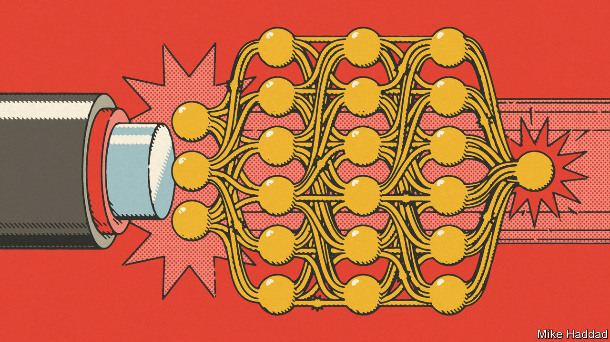

###### Information technology

# Artificial intelligence and the rise of optical computing 

##### Photonic data-processing is well-suited to the age of deep learning 

 

> Dec 20th 2022 

Modern information technology (IT) relies on division of labour. Photons carry data around the world and electrons process them. But, before optical fibres, electrons did both—and some people hope to complete the transition by having photons process data as well as carrying them. 

Unlike electrons, photons (which are electrically neutral) can cross each others’ paths without interacting, so glass fibres can handle many simultaneous signals in a way that copper wires cannot. An optical computer could likewise do lots of calculations at the same time. Using photons reduces power consumption, too. Electrical resistance generates heat, which wastes energy. The passage of photons through transparent media is resistance-free.

For optical computing to happen, though, the well-established architecture of digital electronic processing would have to be replaced by equivalent optical components. Or maybe not. For some people are working on a novel optical architecture that uses analogue rather than digital computing (that is, it encodes data as a continuous signal rather than as discrete “bits”). At the moment, this architecture is best suited to solving one particular class of problems, those of a branch of maths called linear algebra. But that is a potentially huge market, for linear algebra is fundamental to, among other matters, artificial neural networks, and they, in turn, are fundamental to machine learning—and thus artificial intelligence (AI).

The power of the matrix 

Linear algebra manipulates matrices. These are grids of numbers (representing coefficients of simultaneous equations) that can be added and multiplied a bit like individual numbers. Among the things which can be described by matrices are the equations governing the behaviour of electromagnetic radiation (such as light) that were discovered in the 19th century by James Clerk Maxwell. Light’s underlying Maxwellian nature makes it easy, using appropriate modulating devices, to encode matrix data into light beams and then manipulate those data.

Artificial neural networks are programs that represent layers of nodes, the connections between which represent numbers in matrices. The values of these change in response to incoming signals in a way that results in matrix multiplication. The results are passed on to the next layer for another round of processing, and so on, until they arrive at a final output layer, which synthesises them into an answer. The upshot is to allow a network to recognise and learn about patterns in the input data. 

The idea of turning neural networks optical is not new. It goes back to the 1990s. But only now has the technology to make it commercially viable come into existence. One of the people who has observed this transition is Demetri Psaltis, an electrical engineer then at the California Institute of Technology (Caltech) and now at the Swiss Federal Institute of Technology in Lausanne. He was among the first to use optical neural networks for face recognition. 

The neural networks of Dr Psaltis’s youth were shallow. They had but one or two layers and a few thousand nodes. These days, so-called deep-learning networks can have more than 100 layers and billions of nodes. Meanwhile, investments by the telecoms industry—the part of IT that ships data around through all those optical fibres—have made it possible to fabricate and control optical systems far more complex than those of the past.

That is the technological push. The financial pull derives from shedding the cost of the vast amount of electricity consumed by modern networks as they and the quantities of data they handle get bigger and bigger. 

Most efforts to build optical neural networks have not abandoned electrons entirely—they pragmatically retain electronics where appropriate. For example, Lightmatter and Lightelligence, two firms in Boston, Massachusetts, are building hybrid “modulators” that multiply matrices together by manipulating an optically encoded signal according to numbers fed back electronically. This gains the benefit of parallelism for the optical input (which can be 100 times what electronics would permit) while using more conventional kit as what Nicholas Harris, Lightmatter’s founder, describes as the puppet master. 

The modulators themselves are made of silicon. Though this is not the absolute best material for light modulation, it is by far the best-developed for electronics. Using silicon allows hybrid chips to be made with equipment designed for conventional ones—perhaps even affording it a new lease of life. For, as Maurice Steinman, vice-president of engineering at Lightelligence, observes, though the decades’ long rise in the performance of electronics is slowing down, “we’re just at the beginning of generational scaling on optics”. 

Ground zero

Ryan Hamerly and his team at the Massachusetts Institute of Technology (the organisation from which Lightelligence and Lightmatter were spun out) seek to exploit the low power consumption of hybrid optical devices for smart speakers, lightweight drones and even self-driving cars. A smart speaker does not have the computational and energetic chops to run deep-learning programs by itself. It therefore sends a digitised version of what it has heard over the internet to a remote server, which does the processing for it. The server then returns the answer. 

All this takes time, though, and is insecure. An optical chip put in such a speaker could perform the needed linear algebra there and then, with low power consumption and without having to transfer potentially sensitive data elsewhere.

Other researchers, including Ugur Tegin, at Caltech, reckon optical computing’s true benefit is its ability to handle large data sets. At the moment, for example, image-recognition systems are trained on low-resolution pictures, because high-res versions are too big for them to handle efficiently, if at all. As long as there is an electronic component to the process, there is limited bandwidth. Dr Tegin’s answer is to forgo electronics altogether and use an all-optical machine.

This has, however, proved tricky—for what allows neural networks to learn pretty well any pattern thrown at them is the use, in addition to all the linear processing, of a non-linear function in each of their nodes. Employing only linear functions would mean that only linear patterns could be learned. 

Fortunately, although light does behave mostly in a linear fashion, there is an exception. This, Dr Tegin explains, is when an extremely short and intense pulse of it is shone through a so-called multi-mode fibre, which exploits multiple properties of light to enhance its ability to carry parallel signals. In these circumstances, the pulse’s passage changes the properties of the material itself, altering the behaviour of the passing light in a non-linear manner. 

Dr Tegin exploited this feature in what is, save its final output layer, an all-optical network. He describes this in a paper published last year in . He is able to keep all of the information in an optical form right up until its arrival at the last layer—the one where the answer emerges. Only then is it converted into electronic form, for processing by the simpler and smaller electronic network which makes up this layer.

Meanwhile, at the University of California, Los Angeles, Aydogan Ozcan is taking yet another approach to all-optical matrix processing. In a paper published in  in 2018, he and his collaborators describe how to create optical devices that do it without involving electrons at all. 

The magic here lies in the use of thin sheets of specially fabricated glass, each the size of a postage stamp, laid on top of each other in stacks analogous to the layers of an artificial neural network. Together, these sheets diffract incoming light in the way that such a neural network would process a digital image. 

In this case, the optics work passively, like the lens of a camera, rather than receiving active feedback. Dr Ozcan says that provides security benefits. The system never captures images or sends out the raw data—only the inferred result. There is a trade-off, though. Because the sheets cannot be reconfigured they must, if the inference algorithm changes, be replaced. 

How far optical computing of this sort will get remains to be seen. But AI based on deep learning is developing fast, as recent brouhaha about ChatGPT, a program that can turn out passable prose (and even poetry) with only a little prompting, shows. Hardware which can speed up that development still more is thus likely to find favour. So, after decades in the doldrums, the future of optical computing now looks pretty bright. ■


