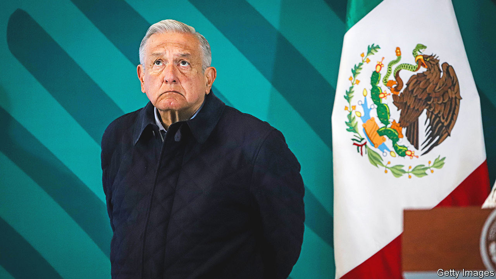

###### Man bites watchdog

# An “electoral reform” in Mexico will make elections less safe 

##### President Andrés Manuel López Obrador is nobbling the electoral commission 

 

> Dec 20th 2022 

When Mexico’s president decides he wants to do something, he does not give up easily. Andrés Manuel López Obrador has long yearned to weaken ’s electoral body, the Instituto Nacional Electoral, known as the INE. He has held a grudge against it since 2006, when he claims that the INE rigged the vote in a presidential election, causing him to lose to Felipe Calderón, a centre-right politician, by 0.6 percentage points. There is no evidence that this is true.

Mr López Obrador’s resolve has only hardened in the face of growing opposition. After tens of thousands of protesters marched in November against his plan to slash the INE’s size, staff and budget, he put on his own protest—dubiously using government funds to do so. When he failed to get the two-thirds majority needed in the lower chamber for his initial proposal, which involved altering the constitution, he reverted to a package of laws which required only a simple majority to pass.

On December 15th, the day Congress stopped for the holidays, the upper chamber voted to approve the package, which makes changes to over 450 articles in five current laws, as well as introducing a new piece of legislation. 

The event was not without rancour: one senator dressed as a dinosaur to protest against the “Jurassic plan”. The reforms will be signed into law by Mr López Obrador in 2023, although opposition lawmakers and the INE will try to appeal to the Supreme Court to have the package struck down for breaching the constitution. 

The reforms are worrying partly because Mexico only became a true democracy in 2000. Key to this process was the creation of the INE. Surveys show that Mexicans trust the INE more than any other institution, bar the . By nobbling it, Mr López Obrador makes it less likely that elections will be free and fair. 

Some of the most damaging ideas of the president’s proposed constitutional amendment were removed. The INE will not be dismantled and its senior people will still be elected by parliamentary votes, rather than directly by the public, as Mr López Obrador had wanted. The electoral court will not be subsumed into the Supreme Court. Still, there is much that is concerning. “This could mean stepping back over the line from a democratic system to an authoritarian one,” says Carlos Bravo Regidor, a political analyst.

By shrinking the INE, the new rules erode its ability to do its job. This includes running elections and monitoring that parties obey the law, along with issuing voter credentials for 97m Mexicans that are used as identity cards. The law scraps the INE’s 300 permanent local branches, responsible for setting up polling stations and running elections in their areas. They will now exist only temporarily, around election time. That entails laying off some 85% of the INE’s 2,500 staff. The rules also curb the INE’s powers to audit, regulate and punish breaches of electoral law. 

There will also be less to regulate, as Mexico’s strict limits on campaigning will become looser. These limits were designed to make elections fairer by reducing the advantages of incumbency. Until now, candidates were banned from campaigning more than three months ahead of elections and in the two days immediately preceding them. Public servants, including the president, were barred from boasting about their achievements during the campaign period. For the past few years TV and radio slots have been distributed equally to parties by the INE, and parties have not been allowed to buy their own. These tough rules were a reaction to the 70-year dominance of the Institutional Revolutionary Party (PRI), which used its deep pockets and chokehold on public office to drown out its rivals. Indeed it was Mr López Obrador and other leftists who campaigned for tighter rules after his loss in 2006. 

But from now on campaigning is not restricted to a set period of time. People in positions of power, including the president, can openly campaign for their party and chosen candidates whenever they like—although they cannot explicitly call for people to vote for them. A rule which bans the use of public funds for “self-promotion” will be scrapped; in theory, the president could use public coffers to print a million leaflets lauding his successes (though such leaflets could not ask people to vote for him). 

Since Morena, the president’s party, is so dominant, this tilts the playing field in its favour, giving it many of the same tools used by the PRI in the past. “It ties the opposition’s hands behind their backs while giving steroids to the ruling party,” says Denise Dresser, an academic.

The president says that the reform will save money. But the INE’s budget in 2022 is 13.9bn pesos ($700m), just 0.2% of federal spending. The INE is large, but so is Mexico: setting up polling booths across it is no easy task. Elections cannot be run on the cheap in a country that in the 1970s and 1980s was racked by electoral fraud.

The INE must make all the changes by August 2023, a rapid turnaround. In 2024 Mexico will hold elections for a new president and Congress (Mr López Obrador cannot run, since he is limited to one term). Mr Regidor reckons the reform could result in political parties, particularly the ruling one, engaging in illegal behaviour, knowing that the electoral authority is not strong enough to punish them. 

Morena has broken rules in the past. Mr López Obrador was found by the INE to have breached electoral laws 29 times in the run-up to midterm elections in 2021, by praising his party during the campaigning period. In December the INE accused Claudia Sheinbaum, the mayor of Mexico City and the favourite to succeed Mr López Obrador, of campaigning illegally early for the election in 2024. It deemed a rally in June, at which she spoke about her record, to have been a campaign event. She says it was not. She is also accused of promoting hashtags such as “EsClaudia” (“It’s Claudia”) on social media and on murals across the country. Both would no longer be illegal under the new law. ■

