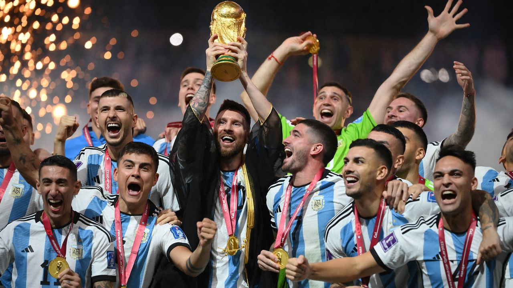

###### It was messy, but it’s Messi

# Argentina clinch the World Cup after beating France on penalties 

##### The national team could teach its politicians a lesson 

 

> Dec 18th 2022 

THEY BEGAN the World Cup by losing to Saudi Arabia, one of the least fancied teams in the tournament. Argentina’s footballers ended it as champions, beating France, the holders, in a penalty shoot-out after a thrilling 3-3 draw. When Gonzalo Montiel drove home the decisive spot-kick, millions of Argentines streamed onto Avenida 9 de Julio, in the centre of Buenos Aires, setting off firecrackers, chanting songs, and honking car horns.  , as the national team is known, took home Argentina’s third cup, and the first in 36 years. 

Argentina expected, and in the end got, a ferocious match. When France took home the World Cup in 2018, their team was younger and their players more expensive . Kylian Mbappé, then just 19, became the second youngest player ever to score in a World Cup final, after Pélé did so at 17 in 1958. This year the French squad is collectively worth over €1bn ($1.1bn), compared with Argentina’s more modest €645m, according to Transfermarkt, a website devoted to transfer fees. 

Yet Argentina saw them off—eventually, having led 2-0 and then 3-2. Mr Mbappé had hauled France back into the game with a penalty and a goal in normal play and then another spot-kick in extra time, becoming only the second man to score three times in a World Cup final. But the glory will belong to Lionel Messi, Argentina’s 35-year-old captain, who despite being widely regarded as the  for many years had never managed to get his hands on the game’s most desired trophy. Fittingly, Mr Messi scored two goals, and set up the whole team for another, netted after a flowing move by Ángel Di María, who finished coolly before bursting into tears. 

Argentina’s fans had already made this World Cup one about their country and its captain. Some 50,000 Argentine supporters descended on Doha for the final, compared with only 10,000 from France, a far richer, more populous country. Argentine , or fans, have a reputation for rambunctiousness. They pen new football songs almost as fast as Mr Messi can dribble through a triad of opposing players, and came armed with drums, giant flags in the national alabaster white and sky-blue stripe, and a whopping 500kg of , the country’s favourite herbal drink. 

The final settled any debate, Argentines crow, about who the greatest living footballer is. Yet Mr Messi has had a chequered relationship with his home country, which he left at 13 to train in Europe. Compared with Diego Maradona, an Argentine midfield megastar of an earlier generation, Mr Messi, who had to be given growth hormones as a child, was long deemed timid and lacking in passion. Maradona () was overheard in 2016 saying that Mr Messi didn’t “have enough personality to be a leader”. Argentines resented the fact that he won often with Barcelona, his club in Spain, but not with the national squad. With Mr Messi at its helm,  lost two finals at the Copa América, Latin America’s top football competition, and one at the World Cup. In frustration, he briefly retired from the national team in 2016. 

All that changed last year, when Argentina won the Copa América trophy for the first time in 28 years. Since then, Messi-mania has gripped the country. His T-shirt, emblazoned with the number 10, has become a national uniform. He has started to sound more combative. Clips of Mr Messi asking Wout Weghorst, a Dutch striker, “What’re you looking at, dummy?” after a nasty quarter-final match which threatened to descend into a brawl, have been remixed to electronic dance music, printed on mugs, and tattooed on the bodies of super-fans. 

In Argentina, the beautiful game is more than a sport. “When they ask you who you are, you answer: I am a son, I am a father and I belong to such and such team,” says Ariel Scher, a journalist who writes about football. “The construction of an identity in this country is unthinkable without some kind of link to football.” 

Football and national identity became intertwined after Argentina beat England in the 1986 World Cup quarter-final in Mexico, in which Maradona scored two goals, one famed for its beauty and the other—a handball not spotted by the referee—for vexing a generation of English fans. Coming on the heels of Argentina’s humiliating defeat after invading the Falkland Islands, a British territory in the South Atlantic, it felt to many like a moment of national vindication. Maradona became, to some, a demi-God. A sect called the Church of Maradona boasts thousands of adherents, its own ten commandments and a newly opened branch in Mexico.

If football is a religion in Argentina, then a World Cup victory is its spiritual apotheosis—and this one comes at a time of . Argentina has been battered this year by record droughts, inflation reaching 100%, and fractious politics. The vice-president, Cristina Fernández de Kirchner, survived an  when a gun held only inches from her face failed to fire; and earlier this month she was sentenced to six years in jail over . 

Against this chaotic backdrop, the national team has spread joy and even temporary harmony. The deep-rooted , or rift, in Argentine politics between Ms Fernández’s followers and the liberal opposition has not been forgotten. But Ms Fernández’s supporters were uncharacteristically quiet after her conviction on December 6th, perhaps because they were at home watching the football. Congress has had trouble reaching the quorum to hold a session, partly because some legislators are in Doha. 

“World Cup fever has helped the government end a year that could otherwise have been explosive in a fairly peaceful way,” says Andrés Malamud, an Argentine political scientist at the University of Lisbon. But as the country’s politicians gear up for a general election in 2023, they cannot expect happy memories of the World Cup to save them. “All the research about the effects of sporting victories on elections shows that they are ephemeral—they don’t last more than two weeks.” 

Still, Argentina’s political class could learn from its sportsmen. The team is more close-knit than in previous World Cups, says Klaus Gallo, a historian who has written on football at Torcuato di Tella University in Buenos Aires. Mr Messi shone not only because of his talent but also because he could rely on the men around him. The country’s divided government, in which the moderate president and the leftist vice-president go for months without speaking, could take note. So could the opposition, which has sometimes fomented the  at the expense of conciliation. 

Much like some Argentines used to deride Mr Messi, Argentine politicians have a habit of undermining their best assets. Ms Fernández and much of her leftist wing of Peronism, the populist movement that has dominated Argentina for seven decades, have vilified Argentina’s agribusiness and the private sector more generally, though these are the motors of the country’s economy. Argentina’s political class could learn from its country’s belated embrace of their star midfielder–if you’ve got it, appreciate it. 

The final lesson comes from Mr Messi and  modest manager, Lionel Scaloni. “In the past five World Cups, Argentina has done better with managers who were humble and focused on planning,” says Mr Malamud. “And they fared badly with managers who were showmen and braggarts.” The braggarts were Maradona in 2010, who, though an excellent player, was a terrible coach, and Jorge Sampaoli in 2018. The hard workers have been José Pékerman in 2006, Alejandro Sabella in 2014 and Mr Scaloni.

The prudence and professionalism of Argentina’s manager and his star player offer a sobering contrast to the amateurism with which Argentina’s economy is managed, with a dozen exchange rates and a host of price and currency controls. Argentina’s political leaders talk a good game, but fail to deliver results. Unlike the quietly spoken, ruthlessly goal-focused Mr Messi.■

