###### The Economist explains

# How to understand 2022 in memes 

##### What distracted The Economist this year 

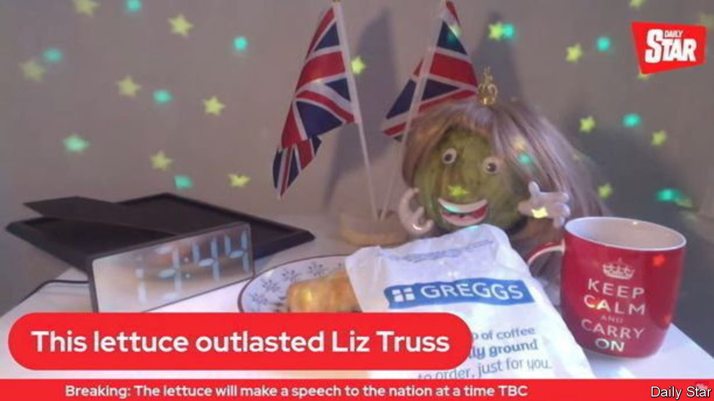 

> Dec 14th 2022 


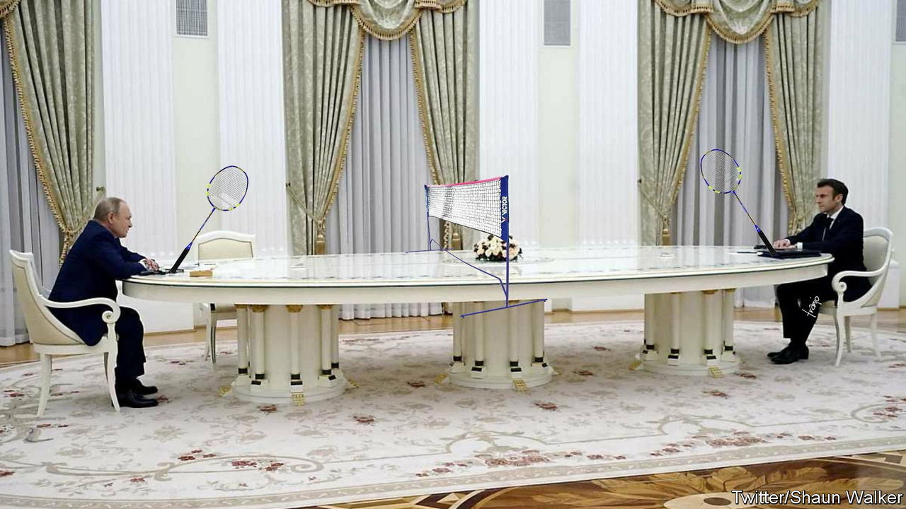 


In February, as Russia massed troops along its border with Ukraine, Vladimir Putin, the Russian president, met his French counterpart, Emmanuel Macron, in the Kremlin. Photographs showed the two men sitting at opposite ends of an enormous table, which was apparently wheeled out as a social-distancing precaution. Mr Putin, who frequently stars in , looked ridiculous. On social media the table soon became a  and a badminton court. The following week Mr Putin, his foreign minister and his defence minister met around another lengthy table. That one became a .


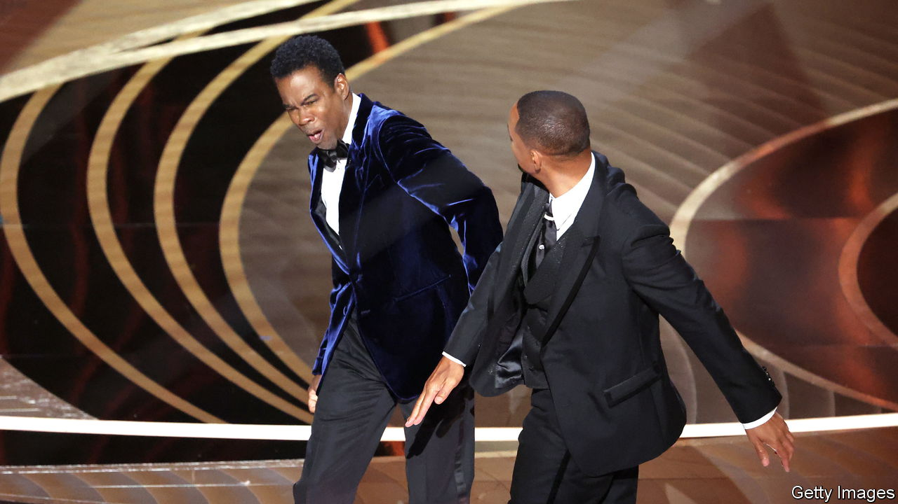 


In March Will Smith, an actor,  Hollywood’s glitterati—and viewers around the world—when he  Chris Rock, a comedian presenting one of the prizes at the Academy Awards. After first appearing to laugh at, and then objecting to, a joke about his wife, Jada Pinkett Smith, Mr Smith stormed on stage and slapped Mr Rock in the face. Later, during his acceptance speech for the Best Actor award for his role in , Mr Smith credited himself, in life and art, with being a “fierce defender” of his family. Within 24 hours, one video of the slap had been watched more than 59m times. Some memes show Mr Smith being guided by a furious Mrs Smith to seek revenge. The Academy banned Mr Smith from the Oscars for ten years.


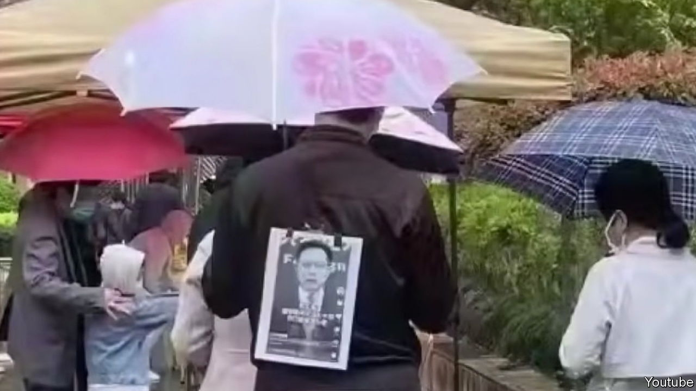 


Chinese censors work tirelessly to scrub the internet of complaints about the country’s brutal covid-19 lockdowns. Yet some memes survive. A favourite captures the Chinese phrase . In December 2021 Zhao Lijian, a spokesman for the ministry of foreign affairs, told foreign journalists that they could  about the privilege of living in China during the pandemic, instead of the West, where the disease was then rampant. Chinese people living through the chaos of “zero covid” now use the phrase to mock the government. People often “chuckle to themselves” during  or when waiting in long queues for covid tests. Even though China’s restrictions are , the ensuing chaos will bring little to laugh about.


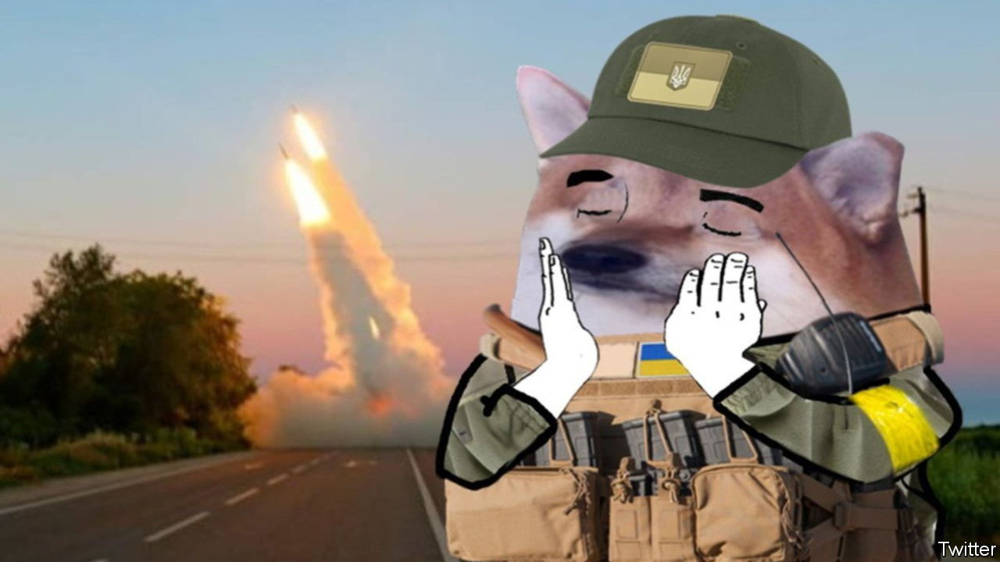 


The North Atlantic Fella Organisation is a  that champions Ukraine and harangues its foes on social media. Its members use the avatar of a cartoon shiba inu dog and post memes mocking Russia’s military performance. The  and imagery were invented and tweeted by a user named  in May, within three months of the invasion. They quickly went viral. The combination of a catchy name, playful imagery and satirical edge provided a collective identity to like-minded activists—including Ukrainian soldiers—who could channel their outrage about the invasion into irreverent images.  of customised NAFO artworks also raise money for Ukraine.


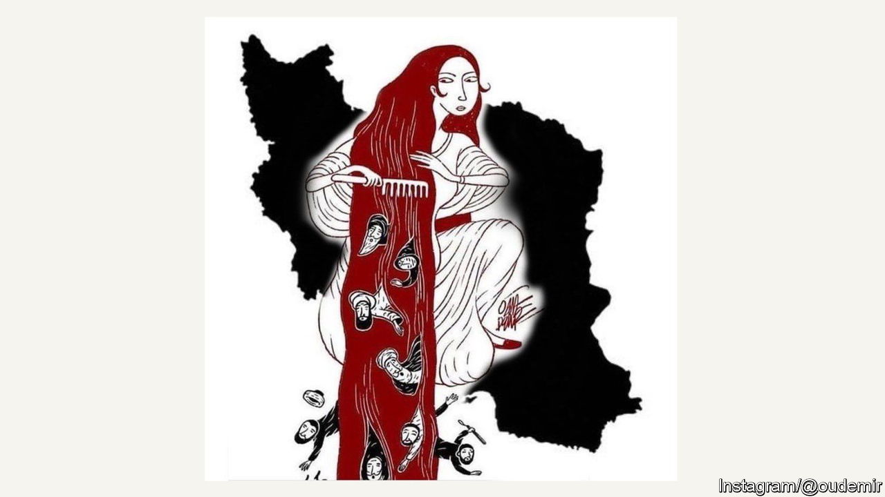 


 have rocked Iran since the death in September of Mahsa Amini, a Kurdish woman who was arrested and allegedly beaten by police for showing her hair beneath her obligatory hijab. In the streets, and online,  is used to capture the bravery of protesters, many of whom are , in standing up to Iran’s theocratic regime. Many images show hair, objecting to the punishments women face for being insufficiently covered. In one Iran is a woman brushing religious clerics from her flowing locks.


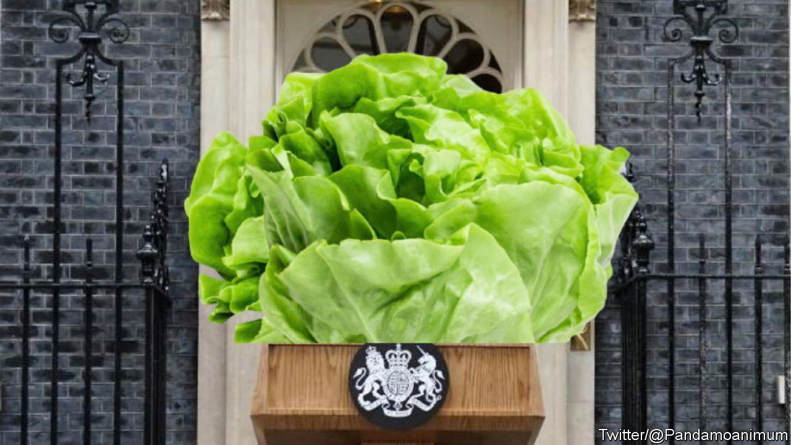 


On October 11th an article in   that the hapless Liz Truss, who had become Britain’s prime minister only on September 6th, was already on her way out. Excluding the mourning period for the death of Queen Elizabeth II, when British politics ground to a halt, Ms Truss had been in control for just seven days, our leader said—“roughly the shelf-life of a lettuce”. The lettuce theme took off. On October 14th the , a tabloid newspaper, launched a live stream of an iceberg lettuce, which was given a blonde wig, to determine whether it could outlast Ms Truss. On October 20th, when the prime minister resigned,  and much of the , proclaimed the lettuce the winner.


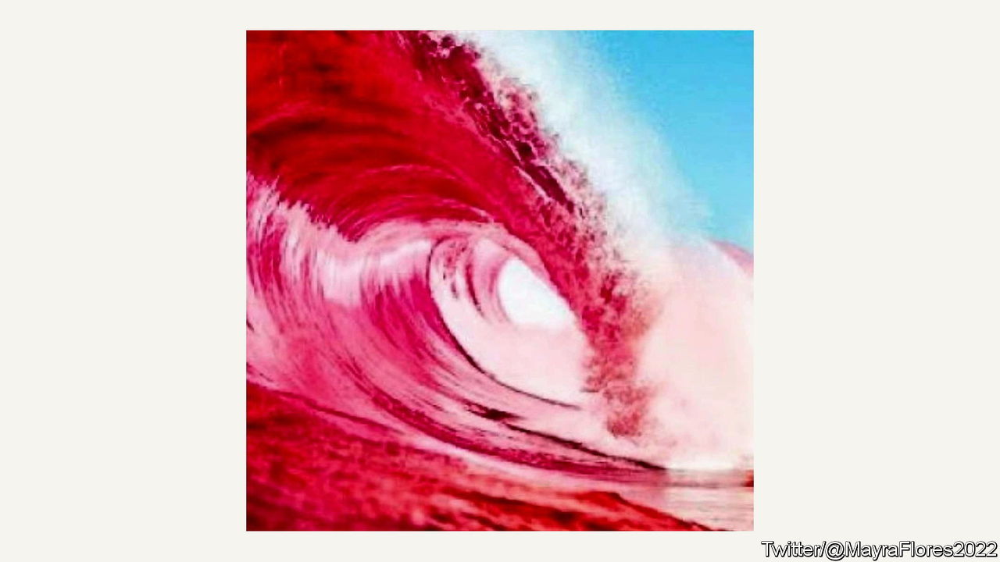 


On the evening of November 8th Lauren Boebert, a Republican congresswoman from Colorado,  that “The red wave has begun!”. Other Republicans accompanied predictions of a substantial victory for their party in America’s midterm elections, with photos of a  Mrs Boebert supported Donald Trump’s lie that he had won the presidential election in 2020; that earned her an endorsement from the former president. But her race was so tight that after a recount she was awarded just 50.06% of the votes. The wave was  Many of Mr Trump’s other favoured candidates lost their races and the Democrats retained control of the Senate.


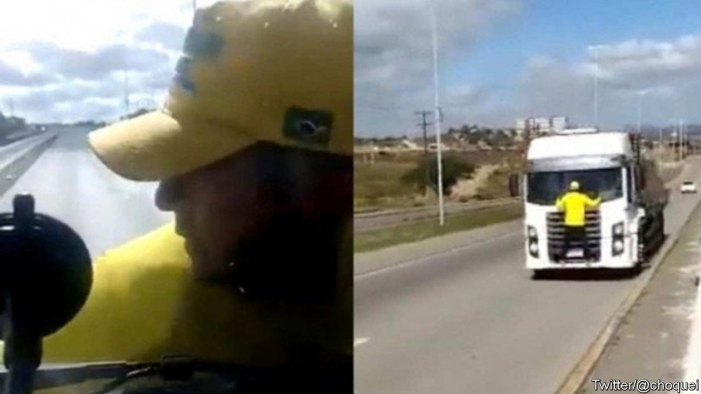 


On October 30th  won Brazil’s presidential election, beating Jair Bolsonaro, the incumbent. Supporters of Mr Bolsonaro blockaded motorways in protest. One , Júnior César Peixoto, found internet fame as , or the “truck’s patriot”. On November 2nd Mr Peixoto, dressed, as Bolsonaro supporters often do, in a Brazilian football shirt and a yellow “Bolsonaro 2022” cap, clung to the front of a lorry during a protest. Later a film of him —yet remarkably calm—as it hurtled 6km down a highway, went viral. Music from the driver’s radio provides the soundtrack to Mr Peixoto’s discomfort. A later meme superimposed him on the .


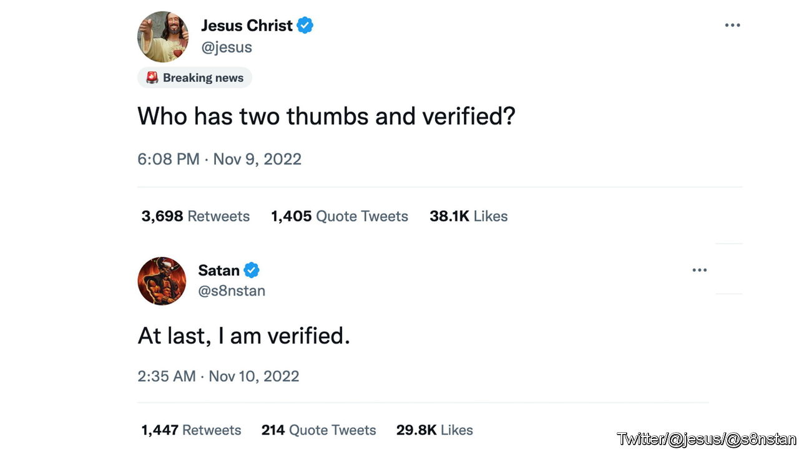 


’s erratic management of  has been a source of much amusement on the platform. One of Mr Musk’s first acts after he bought the company in October was to allow users to purchase a blue tick, which indicates verification on Twitter, for $7.99 per month. Some accounts that paid were roundly . Others impersonated real brands and accounts. Even  got a blue tick. So did . After declaring that his commitment to free speech meant that “comedy is now legal on Twitter”  that parody accounts must include the word “parody” in their usernames. Many then pretended to be the chief twit himself. They were promptly kicked off.


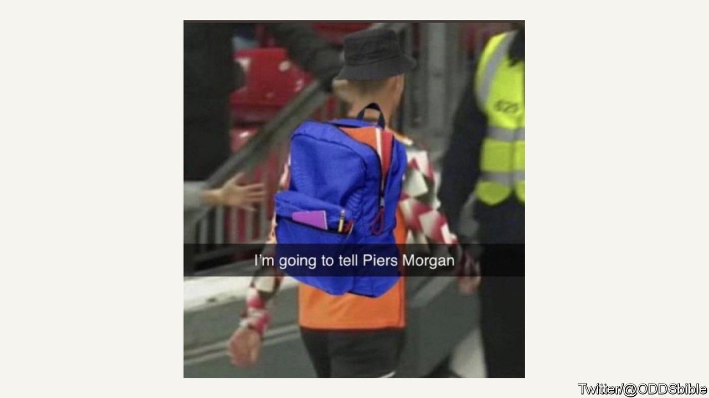 


On November 28th, during a football World Cup match between Portugal and Uruguay, , a brilliant-but-smug Portuguese star, celebrated scoring a goal. Officials later awarded it to his teammate, Bruno Fernandes. One meme shows Mr Ronaldo, with added schoolboy rucksack, marching off the pitch to tell Piers Morgan, a British television host, about the injustice. In an interview with Mr Morgan before the tournament Mr Ronaldo had criticised his club team, Manchester United, who promptly dropped him. When it was later reported that Mr Ronaldo really did text Mr Morgan insisting the goal was his, the internet went wild. To add insult to injury Mr Ronaldo started Portugal’s next (winning) match on the bench. His team were later knocked out by Morocco. ■

