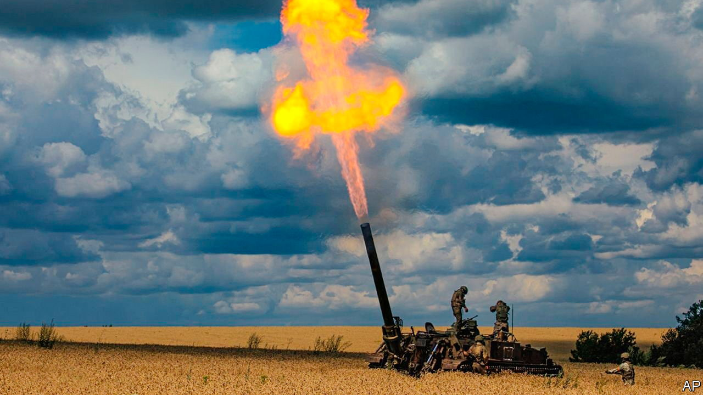

###### The Economist explains

# Is Russia running out of ammunition? 

##### Many of its shells are probably older than the conscripts firing them 

 

> Dec 20th 2022 

“So let me tell Putin tonight what his own generals and ministers are probably too afraid to say,” declared Admiral Sir Tony Radakin, Britain’s chief of defence staff, on December 14th: “Russia faces a critical shortage of artillery munitions.” Ten days earlier Avril Haines, America’s top intelligence official, had offered a similar judgment. Is Russia running out of shells?

Western officials have been talking up Russia’s ammo crunch for months. In September they said that Russia had turned to North Korea for replenishment. In November Lloyd Austin, America’s defence secretary, spoke of “significant shortages”. At a briefing on December 12th a senior American defence official said that, at current rates of use, Russia could sustain “fully serviceable” tube and rocket artillery ammunition only until early 2023.

Others disagree. On December 9th Colonel Margo Grosberg, the head of Estonian defence intelligence, said that Russia had around 10m shells and the capacity to produce 3.4m more within a year. At the peak rate of fire, during the summer in Ukraine’s eastern Donbas region, Russia was using around 20,000 rounds per day, he said, meaning that the country has sufficient ammunition “to fight for at least a year, if not longer”. In a  with  General Valery Zaluzhny, Ukraine’s most senior officer, warned that Russia was preparing for a fresh offensive in the spring, which could include another attempt on Kyiv. “Ammunition is being prepared,” said General Zaluzhny. “Not very good stuff, but still.”

There are several possible explanations for these differing views. One is a difference in the sort of ammunition being counted. America’s tally of “fully serviceable” ammunition could refer to that which is within its expiry dates, properly stored and not in need of refurbishment before use, suggests Michael Kofman of CNA, a think-tank. Estonia’s count probably includes a wider range of ordnance which may be unreliable or unsafe, he says—though not necessarily ineffective.

Russian ammunition is often stored in poor conditions and for far longer than would be the case in NATO armies. If the Pentagon is to be believed, Russia is firing some shells that were produced in the early 1980s. “You load the ammunition, and you cross your fingers and hope it’s going to fire,” said the American defence official. (Ukraine is drawing on old shells too.)

It is also unclear how much ammunition Russia has lost and gained in ten months of war. Its rate of expenditure can be calculated fairly accurately from observed fire. But working out how much ammunition Russia has lost in Ukraine’s long-range  on its depots, which were particularly effective over the summer, is slightly trickier. It is especially hard to pin down the rate at which Russia can replenish these stocks.

Some metrics, such as steel output, offer a clue. But they can also mislead. In September Jack Watling of the Royal United Services Institute (RUSI), another think-tank, explained that earlier assessments of Russian artillery production, from June, had overstated capacity because they focused on Russia’s ability to cast and fill shells rather than on the production of explosives inside. American and British intelligence both say that Russia’s production rate is highly constrained.

As well as making shells, Russia can import them. Belarus has provided large quantities of ammunition from its Soviet-era stockpiles, according to Western officials. But much of that is likely to be sub-par. In his speech, Admiral Radakin accused North Korea of “seeking to smuggle artillery shells to Russia.” But that supply is not substantial at present, according to Ms Haines.

Russia’s rate of shellfire has declined since the intense artillery barrages of the summer. In theory, if its ammunition shortage is as dire as some claim, its rate of fire should fall further over the coming months. In that case, barring an unexpected spurt in production or a generous benefactor, the Russian army will be in no position to mount a large shell-hungry offensive of the sort that General Zaluzhny foresees. But William Owen, a former soldier and now editor of , warns against such rosy calculations. Even if some Russian shells are duds, plenty will work. “You will never go wrong by assuming the Russians have the ammunition they judge they need,” he says. To do otherwise is “utterly pointless and stupidly dangerous.”■


