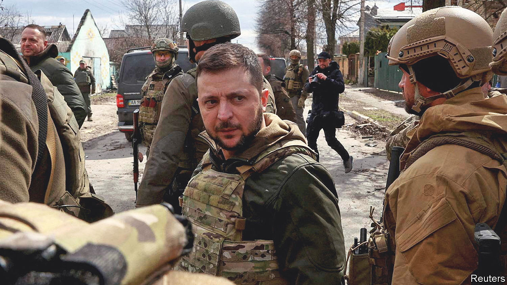
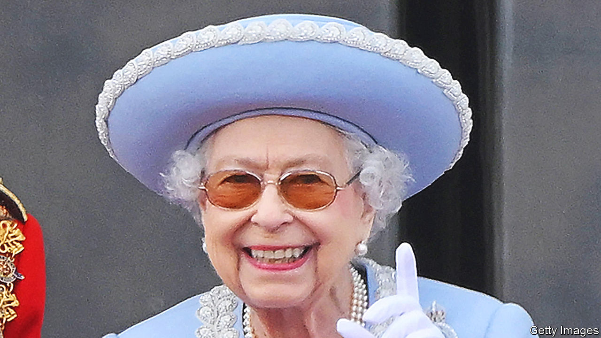
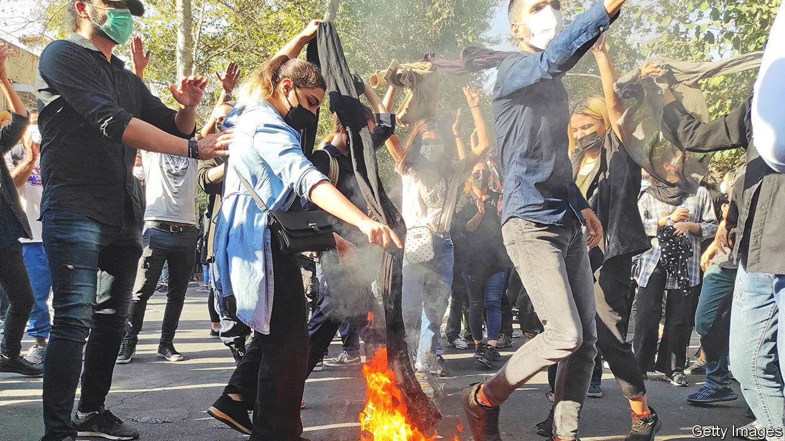
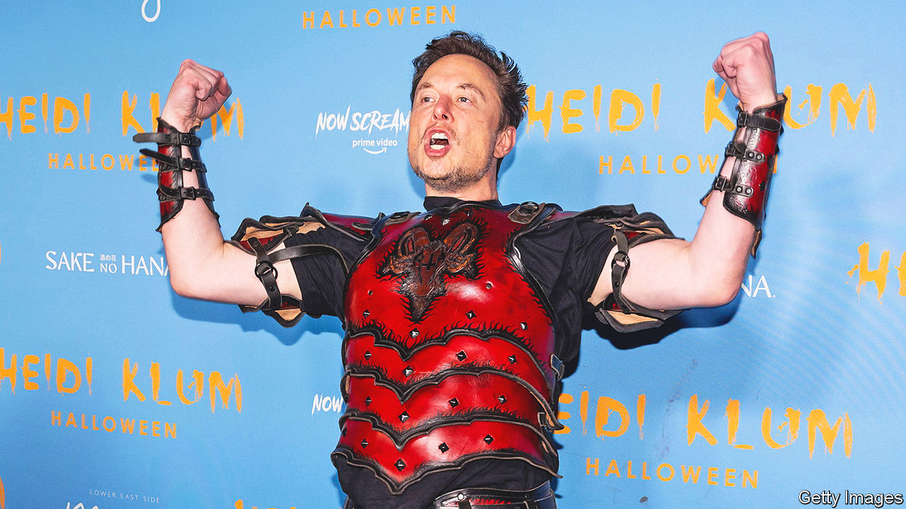
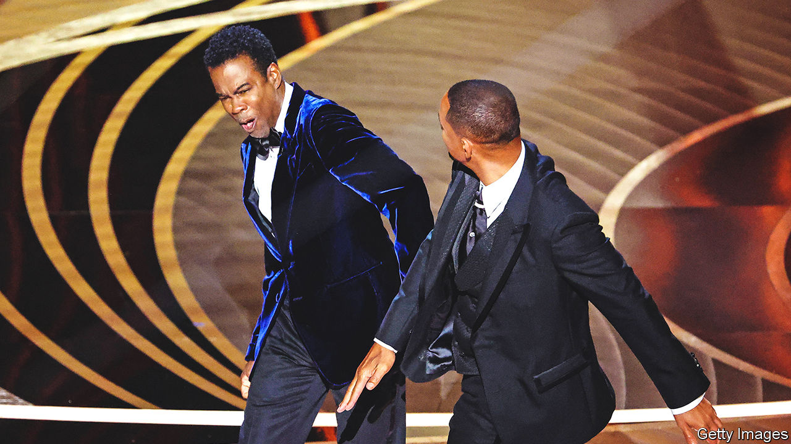

###### The world this year

# The world this year 

#####  

 

> Dec 20th 2022 

. Vladimir Putin’s excuse for this unprovoked act of aggression was that he wanted to “de-Nazify” the country, a democracy with a Jewish president, Volodymyr Zelensky. The invasion, which Mr Putin thought would end in a quick and easy victory, proved spectacularly incompetent. 

Russia failed to take , the Ukrainian capital. Its vehicles and kit broke down. Ukrainians fought hard, picking off Russian fuel and ammunition supplies and pushing the invaders back. America and Europe supplied Ukraine with weapons, cash and intelligence. Russia shelled civilians, tortured captives, kidnapped children and made thinly veiled threats to use nuclear weapons. 

In the bleak midwinter

Some 7.8m  fled from Ukraine; another 7m were internally displaced. America estimated that 100,000 troops on each side had died or been injured in the war and 40,000 civilians had been killed. 

As the year ended, Ukrainians had  much of the territory Russia had stolen. But Mr Putin hundreds of thousands more troops and bombed Ukrainian electricity infrastructure, hoping to freeze civilians over the winter. Ukrainian generals predicted that Russia would launch a big new offensive in early 2023.

Hundreds of thousands of young men left Russia to avoid the draft. Even as a  led by a pal of Mr Putin scours Russian prisons for new recruits to send to the front, Russians are still banned from calling the war a war. 

The West imposed , barring Russia’s banks from SWIFT, a global payments system, freezing many of its foreign assets and banning the sale to it of high-tech components. Hundreds of companies pulled out of Russia, including Apple, bp, Ford and Shell. Russian planes were banned from Western airports. Some wealthy Russians faced sanctions, too. Roman Abramovich gave up his ownership of Chelsea football club. 

The war caused  to soar. Oil rose to nearly $140 a barrel before falling again. Mr Putin cut off most gas supplies to Europe, where governments scrambled to  and subsidise household heating bills. Investment in alternative energy rose. 

The prices of wheat, cooking oil and other essential  rocketed as the war disrupted exports from Ukraine and Russia. The high cost of fuel and food helped spark civil unrest in over 90 countries. 

unveiled a new foreign policy, called the  (turning point). Chancellor Olaf Scholz vowed to raise defence spending and end the country’s long dependence on Russian energy. 

and applied to join nato to protect themselves against Russia. This was awkward for Mr Putin, whose excuses for invading Ukraine included a desire to halt the alliance’s eastward expansion. If both countries join, Russia’s border with nato will have doubled. However, Turkey is holding up the applications. 

And a partridge in a pear tree

For  it was the year of two monarchs, three prime ministers and four chancellors. Boris Johnson resigned, eventually, after becoming the first prime minister to receive a criminal fine (for breaking lockdown rules). “Them’s the breaks,” he said. Liz Truss’s tumultuous seven weeks in Number 10 saw the pound fall to a four-decade low against the dollar, government-bond yields soar and the IMF rebuke her government for its unfunded budget. “The markets will react as they will,” said her chancellor, Kwasi Kwarteng, and they did. Rishi Sunak restored some calm when he took over from Ms Truss. 

 


 died, aged 96, after 70 years on the British throne. Some 250,000 people filed past her coffin as she lay in state. King Charles III, who has promised to follow his mother’s tight-lipped approach to reigning, will be crowned on May 6th. 

‘Tis the season to be jolly

The  virus became less dangerous as more people were vaccinated. Most countries loosened their restrictions, though not in time to allow the unjabbed Novak Djokovic to play in the Australian Open. A truckers’ protest in  against covid mandates morphed into a movement against the government, which enforced the Emergencies Act for the first time. 

Xi Jinping secured a third term as  leader. His “zero-covid” policy was all but  after protests against harsh lockdowns, the biggest since he came to power in 2012. Covid started to spread rapidly in China. Experts fretted that the government has failed to vaccinate old people properly. China continued to avoid the use of highly effective foreign-made vaccines.

 soared to double digits in America, Britain and the euro area, prompting  to tighten monetary policy sharply. In March the Federal Reserve increased its main rate for the first time since 2018. In November the Bank of England raised its rate by the biggest amount since the 1980s. The European Central Bank lifted its from a negative -0.5% to zero, and then higher. 

President  signed a huge package of subsidies to promote clean energy and tackle climate change, the misleadingly named Inflation Reduction Act. America’s Supreme Court overturned , passing control of  policy back to the states. Some 13 states banned most abortions. The Democrats held on to the Senate in midterm elections, defying expectations, and only narrowly lost the House. Candidates in tight races endorsed by  did especially badly. At the end of the year the House committee investigating the assault on the Capitol in 2021 recommended that Mr Trump face charges of insurrection. 

 


The death in custody of  sparked huge protests in . Amini had been arrested by the morality police for wearing her hijab improperly, and died after being beaten. Protesters railed against the theocracy for weeks. Women burned their hijabs in public. Around 15,000 people were arrested; some were executed. 

In  the spike in food prices came on top of a slump in food production caused by a ban on chemical fertilisers. The Rajapaksa brothers were blamed. Mahinda Rajapaksa resigned as prime minister amid the worst economic crisis since independence. Gotabaya Rajapaksa fled the country when a mob stormed his presidential palace.

Joyful and triumphant

 elected a hard-right coalition led by Giorgia Meloni of the Brothers of Italy. Ms Meloni became the country’s first female prime minister. After yet another election in  Binyamin Netanyahu was set to become prime minister again, a year after he left office in disgrace.  got a new president: Yoon Suk-yeol. Emmanuel Macron was re-elected in . In  the Liberals were turfed out after nine years in charge. Ferdinand “Bongbong” Marcos, the son of a dictator, won the presidential election.  got its first-ever president from the left: Gustavo Petro, a former guerrilla fighter. William Ruto won  presidential election. The opposition challenged the result, though there was no repeat of the widespread killings that marred previous ballots. After years seeking the job, and time in prison, Anwar Ibrahim became  prime minister. 

Jair Bolsonaro lost  presidential election, but did not admit it. Without evidence, his party claimed the vote was rigged. The electoral authority dismissed the challenge and fined the party for wasting its time. Luiz Inácio Lula da Silva will be sworn in on January 1st. He vows to halt the destruction of the Amazon rainforest, which accelerated under Mr Bolsonaro.

Imran Khan was ousted as prime minister of  following a vote of no confidence in parliament. He did not go quietly. Six months later his party won most of the seats in a series of by-elections. A few weeks after that Mr Khan was shot in the leg at a rally. 

God rest ye merry gentleman

 


, the founder of Tesla and SpaceX, bought . He sacked the CEO, the entire board and half the staff. Mr Musk said he would allow more free speech, but balked when offensive tweets proliferated and upset advertisers. In December he asked his Twitter followers if he should stay as CEO; . Mr Musk ceased to be the world’s richest man; Bernard Arnault, the boss of LVMH, a luxury firm, surpassed him. 

 were battered during 2022. The shine came off  stocks. The share prices of Meta and Tesla fell by over 60%. Apple briefly reached a stockmarket value of $3trn in January; it is now worth about $2.1trn. The S&amp;P 500 had its worst first half since 1970.  were also hammered, especially after the collapse of FTX, one of the biggest crypto exchanges, whose boss was arrested on suspicion of massive fraud. Bitcoin is down by 65%.

America limited exports to China of  and banned outright chips for use in the development of Chinese artificial intelligence. China took the dispute to the WTO.

The worst drought on record in the  pushed more than 80m people into hunger. Millions are on the brink of famine.

 and the rebellious leaders of the northern region of Tigray agreed to end a civil war. Hundreds of thousands of civilians are thought to have died because of the conflict, mostly from hunger or disease. 

Business and daily life in were constantly disrupted by power cuts. Eskom, the state electricity monopoly, has been so hollowed out by corruption that half of its generation capacity is regularly offline.

, a former prime minister of Japan, was assassinated. , a writer, was stabbed by a jihadist but survived. In 1989 Iran’s late ruler, Ayatollah Khomeini, had ordered Muslims to kill Mr Rushdie for writing “The Satanic Verses”, a novel.

The  passed 8bn, just 12 years after it reached 7bn. Improvements in nutrition and medicine have increased humans’ lifespan. 

Ding-dong merrily on high

 


The  ceremony was full of surprises. “Coda” became the first film released primarily over streaming to win best picture. Will Smith, an actor, slapped Chris Rock, a comic, for being rude about his wife.  reported a dip in subscribers and introduced ads to increase revenue. The biggest box-office hit was “Top Gun: Maverick”, proving that a 60-year-old actor in a leather flight jacket and shades can still pull them in. 

