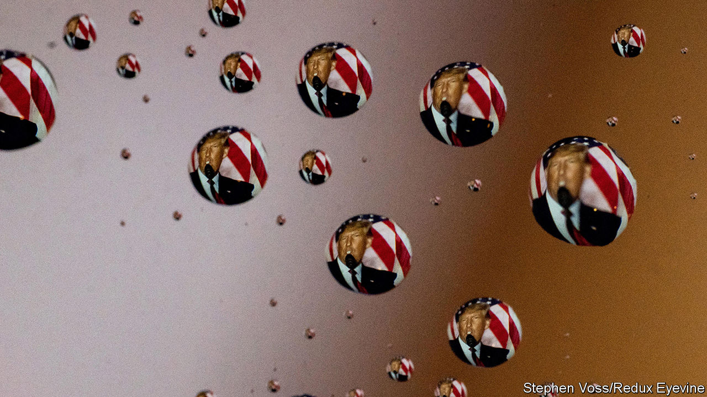
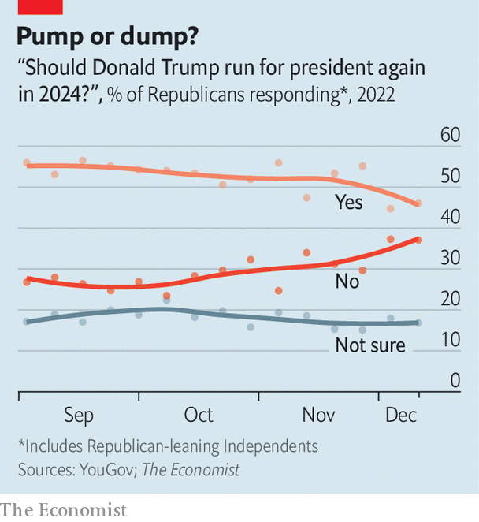

###### Move along

# Donald Trump’s popularity with Republican voters is sinking 

##### Polls reveal a fall in support for him to Make America Great Again, again 

 

> Dec 18th 2022 

IN HIS BOOK “The Art of the Deal”,  admonishes businessmen who engage in cons and implores entrepreneurs to deliver results for their clients. Eventually, he says, a con artist can no longer outrun the people they’ve betrayed. “You can’t con people, at least not for long,”  wrote in his business bestseller, written before his political ascent. “You can create excitement, you can do wonderful promotion and get all kinds of press…But if you don’t deliver the goods, people will eventually catch on.” These remarks are proving prescient about the business of politics. After defeat in three key elections in a row, Republicans are catching on to the con.

New polling from  and YouGov, our partner in weekly surveys of American adults, shows  popularity with Republican voters sinking. According to YouGov’s latest poll, conducted between December 10th and 13th, just 46% of respondents who said they were either Republicans or independents who “lean towards” the Republican Party said they wanted Mr Trump to run for their party’s nomination again. And 37% did not want him to run. These polls were in the field before the House select committee investigating January 6th released its full report, which seems unlikely to help the former president either. 

 


Compared with previous YouGov polls, that is the highest share yet of anti-Trump members of the Republican rank-and-file. In September, when YouGov began asking this question regularly, just 27% of Republicans said they did not want the former president to run again. Since then, the share who want Mr Trump to make America great again, again, has fallen from 56% to 46% (see chart). Some of the biggest declines have been among Republican women (57% to 41%), African-Americans (66% to 42%) and Republican voters who do not have college degrees (62% to 52%).

Mr Trump has also been losing ground in early polls for the Republican nomination in 2024. Several recent surveys have found him trailing Florida’s governor, , in a head-to-head matchup. One poll from Suffolk University in Boston found support for Mr DeSantis at 56%, a full 23 points ahead of Mr Trump. Other surveys disagree. One released by Morning Consult on December 11th shows Mr Trump 18 points ahead of Mr DeSantis. The Republican primary is 14 months away, so these polls are of little use in predicting what would happen in that contest. But they do show that the former president’s return is not as inevitable as once thought.

True, Mr Trump does not need all Republican primary voters to unite behind him in order to secure the nomination. He could win with a plurality. That is because the election rules adopted by many states’ Republican Party committees, which oversee the selection of the presidential candidate, grant all or a significant number of a state’s delegates to the national party convention to the winner of the statewide popular vote. That is how Mr Trump was able to amass a large lead in pledged delegates early in the contest in 2016, despite polling between 30% and 35% for most of February and March, when the earliest-voting states made their choice. 

Though his fortunes are fading, Mr Trump may still have sufficient underlying support to repeat this trick. YouGov’s poll reveals that 38% of Republicans identify themselves as  and 68% still rate Mr Trump “very” or “somewhat” favourably. If the rest of the party is unable to unite behind a challenger—as was the case in 2016 when Ted Cruz, a senator from Texas, John Kasich, then the governor of Ohio, and Marco Rubio, a senator from Florida, split the anti-Trump vote—he could consolidate enough delegates to clinch the nomination again. It is also possible, though unlikely, that the state party committees could change the delegation-selection rules before 2024.

A poor performance by Republicans in  underlined Mr Trump’s political weaknesses. Most of the candidates for Congress that he endorsed did worse than expected and most of those running for statewide office lost. Any dispassionate observer reflecting on his performances in 2018, 2020 and 2022 will see that Mr Trump has now directly or indirectly lost key elections three times and never secured the votes of a majority of Americans (in 2016 the electoral college, not the people, put him in the White House). Most Americans long ago decided that it was time to move on. Republican voters may at last be deciding the same.■


