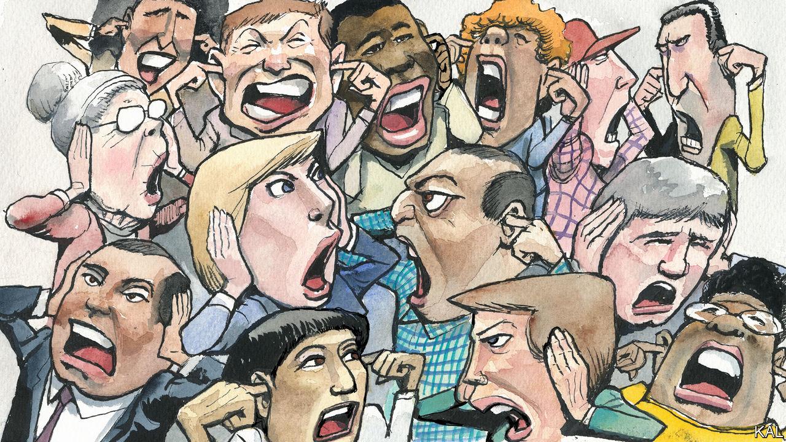

###### Lexington

# Free speech is not in peril in America 

##### The problem is deeper than that 

 

> Dec 20th 2022 

The great American debate about free speech is flaring again, this time around Elon Musk’s curating of Twitter. He is restoring speech rights or denying them, depending on your view. The predictable parties are declaring their positions and luxuriating in righteousness. They will change few minds, also predictably, because they are tussling over the wrong end of the stick. America has no problem with speech. It has a problem with listening. 

Does the distinction seem specious? Speaking and listening do not mean much without each other. But emphasis matters. Focusing on the right to speak rather than the obligation to listen substitutes the easy question for the hard one, and a freedom secured by law for a discipline that must be instilled by culture. It also ensures that the debate—too grand a word, really—remains futile. 

In a self-satirising proof of how emphasising speech-rights leads people to talk past each other, Yale Law students said they were exercising speech-rights last spring when they shouted down a free-speech event because they disapproved of one panellist, a conservative Christian. “You’re disrupting !” a protester shouted at Kate Stith, the professor moderating the event.

Newspapers continue to tie themselves in knots trying to reconcile the politics of their staff with covering a fractious democracy. They tend to default to framing their purpose in terms of protecting the right to speak—as though a publication is meant to serve its interview subjects and op-ed writers—rather than of protecting readers’ opportunity to understand the world. 

This tripped up the editorial board of the  a few days after the incident at Yale. In an attempt to defend free speech, the  wound up coming out against it. “Americans are losing hold of a fundamental right as citizens of a free country: the right to speak their minds and voice their opinions in public without fear of being shamed or shunned,” the newspaper declared. There is no right in America, of course, to silence one’s critics. The  itself is in the business of shaming and shunning (Lexington has some experience of this), and that work is safeguarded, thank goodness, by the First Amendment.

What the paper failed to articulate was why readers (and reporters) needed to listen to views they might find repugnant. The moral logic that once inspired newsrooms—to resist dangerous movements like white nationalism, readers needed to understand them—has been stood on its head. Now, to report empathetically about people and ideas deemed dangerous is to “platform” or “normalise” them. Readers are too dim to be trusted with such information. Journalists are excoriated just for interviewing supporters of Donald Trump. “There’s nothing more to learn from them,” sneered a  columnist, more than a year before some of them attacked the Capitol. 

More speech alone will fix none of this. Besides, insisting that someone must be allowed to speak can violate free-speech rights, as the dean of Berkeley Law School recently told the . He was explaining why nine student groups at the school were justified in banning Zionists from speaking at their events, even though he considered the rule anti-Semitic. 

Like those law students, all Americans can now relax in homogeneous spaces where they hear plenty of speech but nothing that might confound them. Whatever objectionable ideas or information they do encounter will arrive safely filtered through the congenial viewpoint of their chosen cable-news channel, social-media group, newspaper or Substack writer. They can duck the work of hearing alien arguments and sharpening their own ideas or even adjusting them—the kind of work that turns diversity in a pluralistic democracy into a source of resilience rather than a fatally fissiparous weakness.

In 1953, after he finished “Mariners, Renegades &amp; Castaways”, his magnificent study of “Moby Dick”, the Trinidadian intellectual C.L.R. James appended an essay about the circumstances in which he wrote it: he was imprisoned on Ellis Island, awaiting a decision about whether he would be deported. He was disappointed that fellow ex-radicals chose not to help him. Instead, he found, “old-fashioned American liberals” spoke up. 

James brooded upon a quotation from Voltaire above the letters column in the , a newspaper now extinct: “I wholly disapprove of what you say and I shall defend to the death your right to say it.” In the past, he wrote, “I have smiled indulgently at the grandiloquent statements and illusions of these old liberals.” But he began thinking about the conditions in which they struggled to establish the principles he had relied upon. “Today it is not their limitations I am conscious of,” he concluded, “but rather the enormous service they did to civilisation.” 

So many Starbucks

To James, who was deported, one of the most vile characters in “Moby Dick” is Starbuck, the first mate. Starbuck knows Ahab is dooming the ship but lacks the courage to stand up to him. “His story”, James wrote from the depths of disillusion with the Soviet Union and horror at Nazi Germany, “is the story of the liberals and democrats who during the last quarter of a century have led the capitulation to the totalitarians in country after country.”

There is good reason to feel optimistic about America. Democrats heard voters’ concerns about crime and inflation and tempered their more extreme impulses. Voters heard the lunacy of the election-deniers and rejected them. Jurors heard cases against the insurrectionists of January 6th and delivered justice. 

But just as Republican politicians tremble before Mr Trump, some leaders of American institutions, afraid of their students or staff, are still treading Starbuck’s path rather than defending the principles that once made their institutions integral to the American project. They might instead consider the example of Ms Stith as she faced the Yale students. “Grow up,” she urged them. ■


