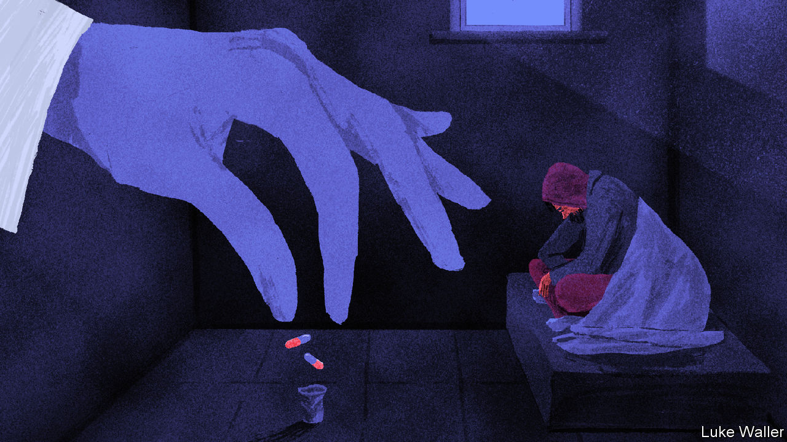

###### Care or confinement

# Is forced treatment for the mentally ill ever humane? 

##### Worsening homelessness prompts new mental-health policies in California and New York 

 

> Dec 19th 2022 

IN AMERICA’S big cities, a walk down the street or a wait for the subway can be an exercise in avoidance. Scores of commuters in Los Angeles, New York and elsewhere don metaphorical blinders every day in order to ignore those sleeping fitfully on the train or battling psychosis on the street. Such indifference is morally fraught, but it is also a reflection of how common  and public displays of  have become. 

Most Americans who experience homelessness do so briefly. They stay with family or crash on a friend’s couch until they can afford rent. (The lack of affordable housing is the biggest driver of homelessness.) The Department of Housing and Urban Development’s latest count of homeless people, tallied on a single night in January, found that 22% of them are “chronically homeless”, and that there were 16% more perennially homeless adults in 2022 than in 2020. Many live in tents beneath highways or in public parks. They are more likely to be suffering from drug addiction and mental illness, both of which can be made worse by living on the streets. The number of people sleeping outside has increased by roughly 3% since 2020, cancelling out the modest decline of people in shelters. As the ranks of unsheltered people have grown, an old question re-emerges: how should government help people who may not be able to help themselves? 

The places most troubled by this, New York City and California, are trying to find an answer. Both have enacted policies aimed at people who are homeless and suffering from a psychotic disorder, such as schizophrenia. Yet they differ in important ways. Last month Eric Adams, the Democratic mayor of New York City, instructed police and first responders to hospitalise people with severe mental illness who are incapable of looking after themselves. Mr Adams’s plan is a reinterpretation of existing rules. Law-enforcement and outreach workers can already remove people from public places if they present a danger to themselves or others. But now, the mayor stressed, people can be hospitalised if they seem merely unable to care for themselves. “It is not acceptable for us to see someone who clearly needs help and walk past them,” Mr Adams proclaimed.

The mayor’s plan follows a policy change on the opposite coast. At the urging of Gavin Newsom, California’s Democratic governor, the state legislature passed the Community Assistance, Recovery, and Empowerment (CARE) Act in September , creating a new civil-court system aimed at directing the mentally ill and homeless to treatment and housing. Patients can be referred to CARE court by police, outreach workers, doctors or family members, among others. 

Acceptance into the system means court-ordered treatment for up to two years, after which patients can “graduate” or, potentially, be subjected to more restrictive care, such as a conservatorship. California has been quick to try to distance CARE court from New York’s apparently more punitive response. “It’s a little bit like apples and giraffes,” says Jason Elliott, Mr Newsom’s deputy chief of staff. “We’re both trying to solve the same problem, but with very different tools at our disposal, and also really different realities.” 

The biggest difference between the two policies is their size. Because New York City recognises a right to shelter, the vast majority of the roughly 68,000 homeless people there have a roof over their heads. Experts reckon that Mr Adams’s order may at first affect only those few hundred people in the most dire straits. The California Policy Lab at the University of California estimates that 10% of unsheltered people in Los Angeles who took part in street outreach programmes had been diagnosed with a psychotic disorder of the kind that CARE court is supposed to help manage. Because more than 100,000 Californians are sleeping rough, the state thinks that up to 12,000 people may initially be eligible for treatment. 

A swinging pendulum

The schemes may be different, but the outrage they inspire is similar. Any discussion of compulsory treatment for the mentally ill is tangled up in a decades-long fight over the balance between protecting people’s civil liberties and bodily autonomy, and ensuring their safety and that of others. Officials and critics alike are squeamish about any reform that evokes the horrors of state-run asylums in the 20th century, which were often unsanitary, overcrowded and understaffed, and sometimes just cruel. When government-run hospitals were shut down, community-based care was supposed to take their place. Instead, patients were often discharged to underfunded boarding houses and shelters. “We have not only abandoned people with severe mental illness to the jails, but also to the streets,” says Elizabeth Bromley, a psychiatrist at UCLA. 

Many liberals blame Ronald Reagan for the government’s abandonment of mentally ill Americans. As governor of California in 1967, Reagan signed a landmark bill for patients’ rights, but then cut funding for mental-health care. As president in 1981, he rescinded federal funds for state mental-health services. But Alex Barnard, a sociologist at New York University, argues that heaping blame on Reagan is too simple. “Many administrations in California have had opportunities to reverse Reagan,” he says. Perpetuating the myth of Reagan’s total culpability, he adds, is “a way of distracting ourselves from the real challenge of building a system today that meets people’s needs, rather than just wishing we had it 50 years ago.” 

Civil-rights advocates in both states worry that the new policies herald a swing of the pendulum back towards confinement. It is unclear how often mentally ill people are detained for examination or treatment, but recent research suggests that the average yearly detention rate in 22 states increased by 13% between 2012 and 2016. Many critics argue that involuntary treatment is not only brutal, but ineffective. But the evidence is mixed and conducting research is tricky, says Mr Barnard. “You can’t randomly assign people to voluntary and involuntary treatment if you think that somebody is at risk of killing themselves,” he explains. Mr Adams’s plan and Mr Newsom’s CARE court both aim to exhaust options for voluntary treatment before mandating medication or hospital. 

Logistical questions abound, too. Luke Bergmann, the director of behavioural health services in San Diego County, worries about how severely ill, often isolated patients are supposed to travel to their court appointments, and whether there will be enough beds in long-term care facilities to house them. Watchdogs on both coasts wonder what kind of clinical training police will receive, and whether racial bias will lead to worse outcomes for black and Hispanic homeless people. Brian Stettin, Mr Adams’s senior adviser for mental health, admits that confrontations with police can be traumatic, and stresses that cops will work alongside medical workers. 

That Mr Newsom and Mr Adams are rethinking involuntary treatment reflects the failures of America’s mental-health system, but also their recognition that homelessness represents a political problem for their administrations—and their careers. As unsheltered homelessness has grown, Americans have become accustomed to public displays of profound suffering. Californians routinely say that homelessness is one of the most important issues facing the state; New Yorkers worry most about crime. 

Allowing the mentally ill to languish in the streets contributes to a feeling that public safety and quality of life in America’s biggest cities are deteriorating. Mr Newsom and Mr Adams are two of the Democratic Party’s most charismatic and ambitious politicians. Should either seek higher office one day, they will be asked what they did to solve the hardest problems in their respective domains. Now they will at least have an answer.■


