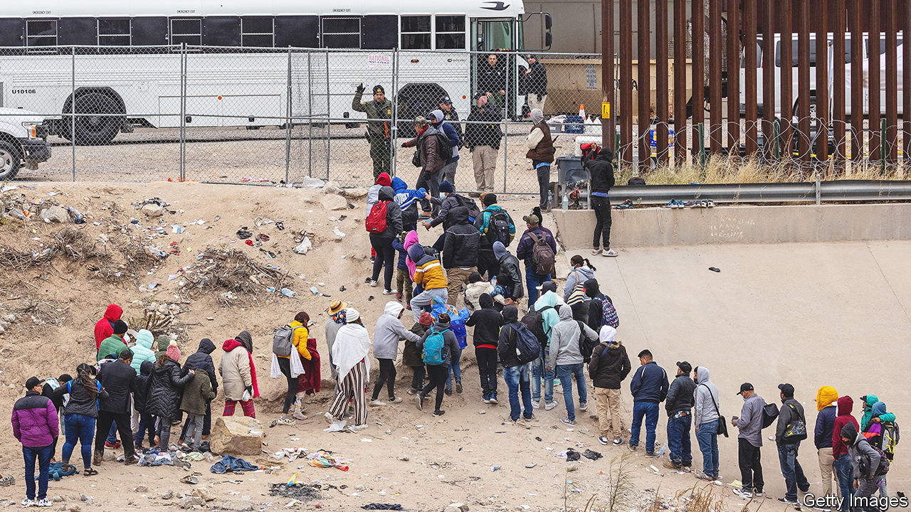

###### Disorder on the border

# Title 42 might be nixed 

##### What the end of an obscure public-health order will mean for America’s border 

 

> Dec 20th 2022 

AS A BABY, Jesus was a migrant, forced to flee the threat of violence and seek refuge in Egypt. So it is perhaps fitting that in the run-up to the day celebrating Jesus’s birth America is confronted by problems about how to manage an influx of migrants arriving at its southern border. A border policy called “Title 42”, which was due to expire on December 21st, was granted a temporary administrative stay by the Supreme Court. Depending on what the court decides, the controversial policy could be wound down in a matter of days.

Title 42 is an obscure public-health rule (first invoked during the Trump administration) which enabled America to expel people who crossed the border without authorisation, due to the risk covid-19 posed. It has doubled as an immigration tool used to manage the large numbers of people arriving at America’s southern border, driven by instability in their home countries and, over the past two years, the perception that Joe Biden’s administration would be more welcoming than Donald Trump’s was. From March 2020 through October 2022, Title 42 was invoked to rapidly process and expel migrants around 2.5m times.

Republicans, who have made tighter border security a core issue, hoped that Milton Friedman’s aphorism, that nothing is so permanent as a temporary government programme, would prove true for Title 42. But in April the Centres for Disease Control and Prevention (CDC) announced it was no longer necessary for public-health purposes. Nineteen Republican states sued to prevent a wind-down, saying that without it they would be overwhelmed by migrants. On December 16th a federal judge ruled against Republican states requesting that its cancellation be delayed—which is why they asked the Supreme Court to grant an “administrative” stay to keep Title 42 in place temporarily.

Officials in El Paso, Texas, expect arrivals to increase by as much as 40% once Title 42 is lifted. Greg Abbott, Texas’s Republican governor, has predicted “total chaos”. However, the furore surrounding Title 42 distracts from a broader conversation that needs to happen in Washington, DC, about America’s immigration laws and how they should be rethought.

The last time America enacted broad immigration reform was in 1986. Since then there have been three big changes in arrivals, besides their greater number. First, whereas most used to be Mexicans, migrants are now much more of a mix, including Venezuelans and Cubans, which increases the challenge of sending them back. Second, the number of family units and children has risen: typical migrants are no longer single Mexican males seeking to work in America. Third, the share of people claiming asylum has swelled, complicating efforts to decide on their claims quickly. “Asylum used to be the exception to the rule at the border”, but “now the exception has overtaken the rule,” says Theresa Cardinal Brown at the Bipartisan Policy Centre, a think-tank.

The Biden administration is hiring 3,500 extra staff and contractors at the border to deal with the influx. But it is under pressure to do more. There are reportedly discussions in the White House about whether to embrace some Trump-like controls, for example limiting asylum eligibility to people who would be tortured if they returned home, or restricting people from applying for asylum in America if they passed through another country where it was safe to apply. Immigration activists will balk at the revival of policies reminiscent of Mr Biden’s predecessor. Once again Mr Biden faces a test of whether he is willing to anger progressives.

Ultimately Congress needs to change immigration law to deal with the border better, revamping asylum laws and creating more legal pathways to come and work. It is “extremely unlikely” to do so in the next Congress, predicts Aaron Reichlin-Melnick of the American Immigration Council, another think-tank. In 2023 the Republican-controlled House is expected to hold hearings and push for the impeachment of the secretary of homeland security, Alejandro Mayorkas, who oversees immigration. That would keep the border in the headlines but do nothing to fix it. ■


